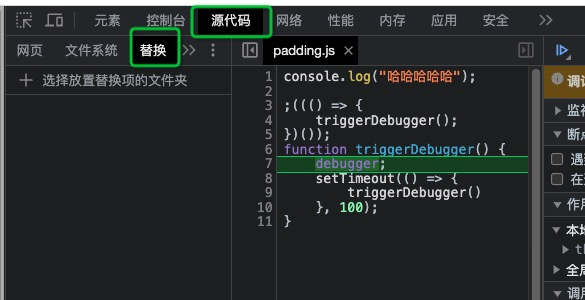
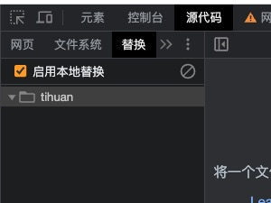
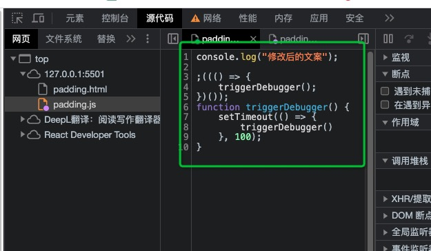
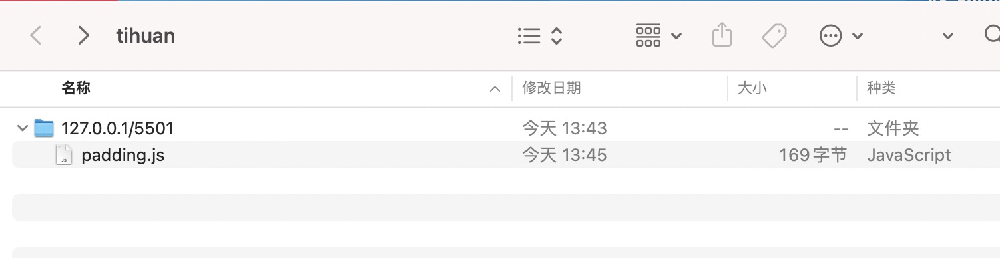

# 浏览器调试-替换代码
## 原理
有点类似浏览器代理了这个url的资源，原来是请求`服务器`，现在是请求你这个文件夹下的`文件`。
## 步骤
1. 在本地新建一个文件夹，用来存储修改的文件。
2. 调出控制台，点击`源代码`下的`替换`，并选择你刚新建的文件夹。

效果如下：

3. 切换到`网页`tab，选择一个资源文件，直接在编辑器中修改，然后ctrl + s进行保存，浏览器会自动将修改的文件添加到你新建的文件夹中，并进行代理，使其生效。  
`在此区域编辑：`

4. 之后可以刷新页面，即可看见效果。
5. 新建的文件夹截图：
