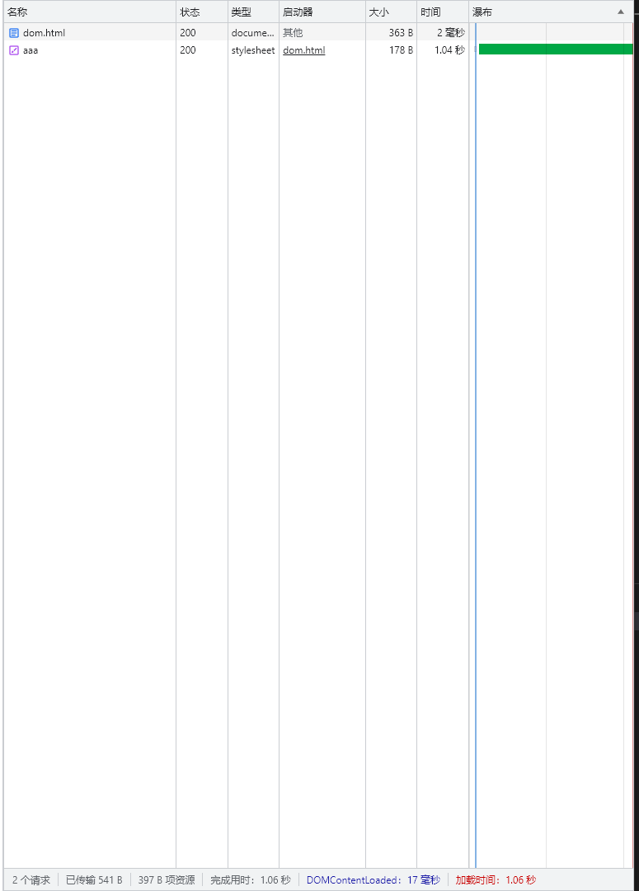
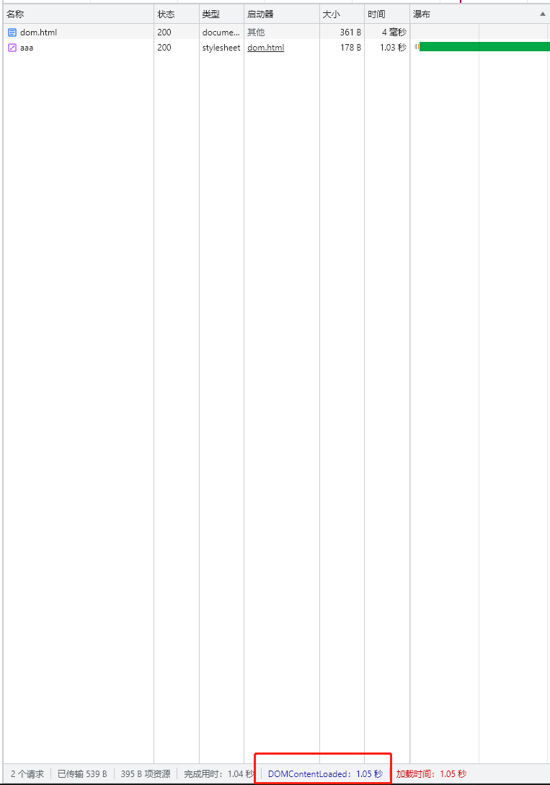
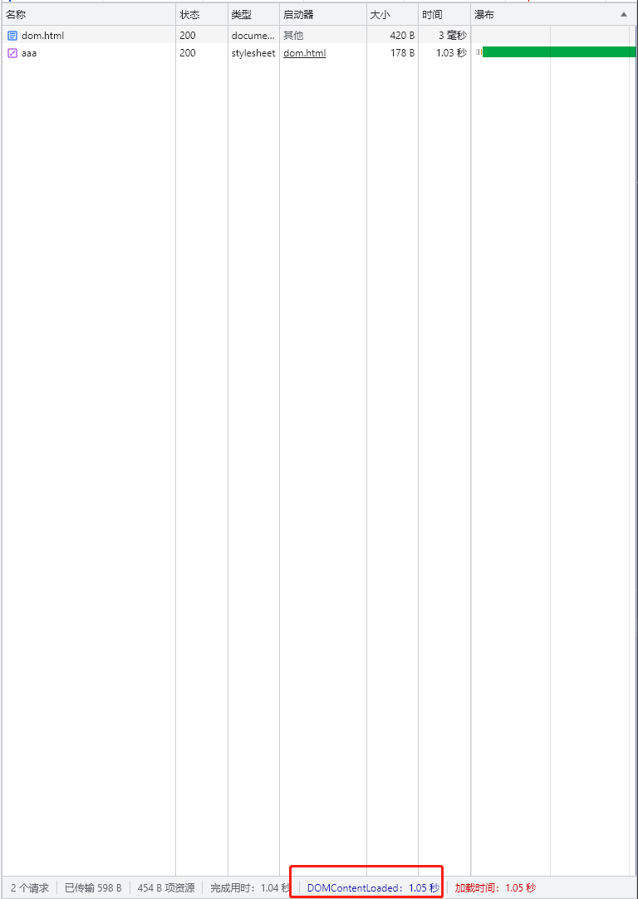

# style外部标签对domcontentloaded的影响
## 当外部style标签放到head中，（没有script）
当外部style标签放到head中，不阻塞DOMContentLoaded执行。
```html
<!DOCTYPE html>
<html lang="en">
<link>
    <meta charset="UTF-8">
    <meta http-equiv="X-UA-Compatible" content="IE=edge">
    <meta name="viewport" content="width=device-width, initial-scale=1.0">
    <title>Document</title>
    <link href="http://localhost:3000/aaa" rel="stylesheet"></link>
</head>
<body>
    <div>hhhhh</div>

</body>
</html>
```

## 当外部style标签放到body中或body后，（没有script）
当外部style标签放到body中或body后，会阻塞DOMContentLoaded执行。
```html
<!DOCTYPE html>
<html lang="en">
<link>
    <meta charset="UTF-8">
    <meta http-equiv="X-UA-Compatible" content="IE=edge">
    <meta name="viewport" content="width=device-width, initial-scale=1.0">
    <title>Document</title>
</head>
<body>
    <div>hhhhh</div>
    <link href="http://localhost:3000/aaa" rel="stylesheet"></link>

</body>
</html>
```

## style标签后面存在script标签，且script标签存在内容
1. 当script标签没有内容时，不会阻塞DOMContentLoaded触发。
2. 有内容时，会等待style加载完且构建成cssom后，执行script脚本后才会触发DOMContentLoaded。
```html
<!DOCTYPE html>
<html lang="en">
<link>
    <meta charset="UTF-8">
    <meta http-equiv="X-UA-Compatible" content="IE=edge">
    <meta name="viewport" content="width=device-width, initial-scale=1.0">
    <title>Document</title>
    <link href="http://localhost:3000/aaa" rel="stylesheet"></link>
    <script>
        console.log(123)
    </script>
</head>

<body>
    <div>hhhhh</div>
</body>
</html>
```

