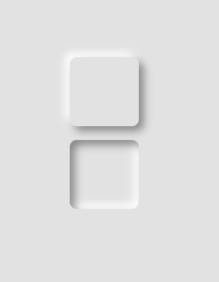

# 实现一个拟态风格的按钮
## 代码实现
```html
<div class="shadow"></div>
<div class="shadow inset"></div>
<style>
    .shadow {
        --w: 100px;
        --s: 100px;
        margin-top: 20px;
        width: var(--w);
        height: var(--s);
        box-shadow: 7px 7px 12px rgba(0, 0, 0, .4), 
                    -7px -7px 12px rgba(255, 255, 255, 1);
        border-radius: 10px;
    }
    .inset {
        box-shadow: inset 7px 7px 12px rgba(0, 0, 0, .4), 
                    inset -7px -7px 12px rgba(255, 255, 255, 1);
    }
</style>

```
## 效果
