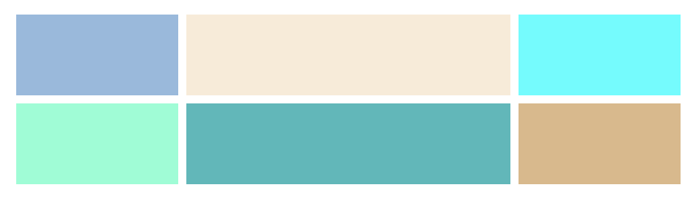
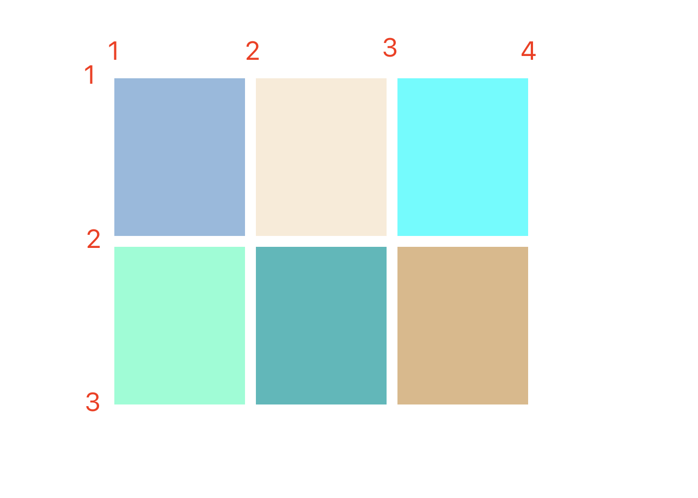

# CSS布局之Grid布局
## Grid布局是什么？
Grid布局是一种新的布局模型，是一种`css二维布局`。CSS Grid布局是一种用于网页布局的CSS模块，它允许您创建基于网格的布局，即将页面分割成一个或多个行和列的网格，然后将内容放入这些网格中。
## 如何创建Grid布局
可以通过`display: gird`或`display: inline-grid`来创建一个网格容器。
## 容器属性介绍
### display属性
`grid`和`inline-grid`属性区别：容器元素是块元素还是行内元素，有点类似`block`和`inline-block`;
### grid-template-columns和grid-template-rows属性
`grid-template-columns`属性设置列宽，`grid-template-rows`设置行高。
#### 固定列宽
```css
.wrapper {
    display: grid;
    grid-template-columns: 100px 200px 100px;
    grid-gap: 5px;
    grid-template-rows: 50px 50px;
}
```

以上表示固定列宽为100px 200px 100px，固定行高为50px 50px;  


**repeat()函数**：该函数接受两个参数，第一个是`重复的次数`，第二个参数是所要`重复的值`。[详细文档](https://developer.mozilla.org/zh-CN/docs/Web/CSS/repeat)。  
利用repeat函数，上面的css可以写成这样
```css
.wrapper {
    display: grid;
    grid-template-columns: 100px 200px 100px;
    grid-gap: 5px;
    grid-template-rows: repeat(2, 50px);
}
```
**auto-fill关键字**：表示自动填充，让一行（一列）尽量容纳更多单元格。`grid-template-columns: repeat(auto-fill, 200px)`表示每列宽度为200px，但是每行能容纳列的数量和自身元素宽度相关，如果有五个元素，而容器宽度超过1000px，它里面的单元格并不会超过200px以填充完所有区域，而是以200px展示。而`auto-fit`则会填充所有区域。    
**fr关键字**：fr表示网格容器剩余宽度中的一等分。`grid-template-columns: 200px 1fr 2fr`表示第一列宽度为200px，第二个占据`1/3`,第三个占据`2/3`。(有点类似百分比，但是它是基于剩余部分的)。  
**minmax**函数：`minmax()`函数产生一个长度范围，表示在这个范围内就可以应用到网格项目中。它有两个参数，第一个最小值，第二个最大值。`grid-template-columns: 1fr minmax(300px, 2fr)`:它的意思是第二列的宽度最小是300px，但是不能大于第一个列的`2倍`。  
**auto关键字**：例如`grid-template-columns: 100px auto 100px`，它的意思是第一列和第三列宽度为100px，第二列宽度为剩余宽度。有点类似`flex-grow: 1`,且兄弟节点没有flex-grow的感觉。利用这个属性可以很简单地实现两栏布局或三栏布局。
### grid-row-gap、grid-column-gap以及grid-gap属性
`grid-row-gap`设置每个单元格之间的行间距，`grid-column-gap`设置单元格之间的列间距。而grid-gap属性就是一个简写。
```css
/* 可以简写成grid-gap: 10px 20px; */
grid-row-gap: 10px;
grid-column-gap: 20px;
```
### grid-template-areas属性
`grid-template-areas`属性用于定义一个区域，一个区域由一个或多个单元格组成。
一般这个属性会配合`grid-area`一起使用，当定义完`grid-template-areas`后，为子元素设置`grid-area`，css就会将指定子元素放到定义的位置。
```css
.wrapper {
    display: grid;
    grid-gap: 10px;
    grid-template-columns: 120px 120px 120px;
    height: 300px;
    width: 500px;
    grid-template-areas: 
    ". header ."
    "sidebar content content";
}
.one {
    background-color: rgb(146, 186, 222);
    grid-area: content;
}
.two {
    background-color: antiquewhite;
    grid-area: header;
}
.three {
    background-color: aqua;
    grid-area: sidebar;
}
/* 此处省略部分代码 */
```
此代码会将`grid-area`属性指定的区域放到设定好的范围内，如果没有设置`grid-area`，则放到`.`这个区域内。
### grid-auto-flow属性
此属性控制着自动布局算法怎样运作，精确指定在网格中被自动布局的元素怎样排列。[参考文档](https://developer.mozilla.org/zh-CN/docs/Web/CSS/grid-auto-flow)。
```css
/* 语法： */
/* Keyword values */
/* 表示按行来逐行填充，必要时增加新行 */
grid-auto-flow: row;
/* 表示按列来逐行填充，必要时增加新列 */
grid-auto-flow: column;
/* 表示如果正常填充出现空缺的话，如果后面的元素可以填充这个空缺，则将后面的元素放到这个空缺里，这个元素可能会打乱dom显示顺序 */
grid-auto-flow: dense;
/* 表示按行来逐行填充，如果有空缺，后面元素会试图填充空缺 */
grid-auto-flow: row dense;
/* 表示按列来逐列填充，如果有空缺，后面元素会试图填充空缺 */
grid-auto-flow: column dense;

/* Global values */
grid-auto-flow: inherit;
grid-auto-flow: initial;
grid-auto-flow: unset;
```
### justify-items、align-items以及place-items属性
`justify-items`属性设置单元格内容的水平位置（左中右）,`align-items`属性设置单元格内容的垂直位置（上中下）。相当于设置单元格内容靠哪边。`place-items`就是前面两个属性的简写。
### justify-content、align-content以及place-content属性。
`justify-content`属性设置整个内容区域在容器里面水平位置（左中右），`align-content`属性是垂直位置（上中下）。
### grid-auto-columns以及grid-auto-rows属性
1. 他们的属性和`grid-template-columns`以及`grid-template-rows`一样。  
2. **`显式网格和隐式网格`**：显式网格包含了你在`grid-template-columns`以及`grid-template-rows`属性中定义的行和列，超出单元格都算隐式网格。他们的网格就是按照`grid-auto-columns`以及`grid-auto-rows`属性来设置。
## 单元格属性介绍
### grid-column-start、grid-column-end、grid-row-start以及grid-row-end属性
这四个属性可以指定单元格所在的区域位于哪四根网格线中间。
* grid-column-start：左边框所在垂直网格线，也可以设置成横跨几列。
* grid-column-end：右边框所在垂直网格线，也可以设置成横跨几列。
* grid-row-start：上边框所在水平网格线
* grid-row-end：下边框所在水平网格线

### grid-area属性
上方<a href="#grid-template-areas属性">`grid-template-areas`</a>中有提及它的作用。
### justify-self、align-self以及place-self属性。
justify-self属性设置单元格内容的水平位置，只作用于自身。  
align-self属性设置单元格内容的垂直位置，只作用于自身。  
place-self是上面两个属性的简写。  
## 参考
[最强大的 CSS 布局 —— Grid 布局](https://juejin.cn/post/6854573220306255880)
