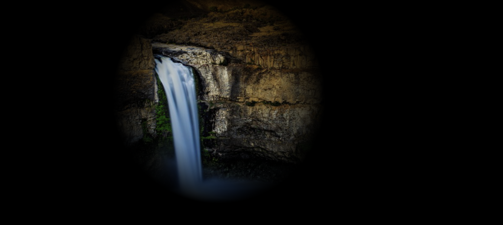

# 实现一个手电筒照亮效果
## 效果
<figcaption>正常效果：</figcaption>



<figcaption>滚轮放大效果：</figcaption>


## 关键代码
1. 通过mask的渐变遮罩实现一个过渡效果
```css
mask: radial-gradient(circle at var(--x) var(--y),
    transparent 0%,
    rgba(0, 0, 0, 0.2) var(--radius),
    rgba(0, 0, 0, 1) calc(var(--radius) + 15%),
    #000 100%);
```
2. 获取css变量的样式
- 如果直接使用`dom.style.getPropertyValue("--radius")`,这种方法只能获取`行内样式`，如果要获取css样式，则需要`getComputedStyle`来获取样式表。
```javascript
getComputedStyle(mask).getPropertyValue("--radius")
```
## 代码实现
```html
<!DOCTYPE html>
<html lang="en">

<head>
    <meta charset="UTF-8">
    <meta http-equiv="X-UA-Compatible" content="IE=edge">
    <meta name="viewport" content="width=device-width, initial-scale=1.0">
    <title>Document</title>
    <style>
        body {
            overflow: hidden;
        }
        * {
            margin: 0;
            padding: 0;
        }
        .wrapper {
            width: calc(100vw);
            height: calc(100vh);
        }

        .img {
            width: 100%;
            height: 100%;
        }

        .mask {
            --radius: 20%;
            --x: 330px;
            --y: 200px;
            position: absolute;
            width: 100%;
            height: 100%;
            top: 0;
            left: 0;
            background-color: #000;
            mask: radial-gradient(circle at var(--x) var(--y),
                    transparent 0%,
                    rgba(0, 0, 0, 0.2) var(--radius),
                    rgba(0, 0, 0, 1) calc(var(--radius) + 15%),
                    #000 100%);
            -webkit-mask: radial-gradient(circle at var(--x) var(--y),
                    transparent 0%,
                    rgba(0, 0, 0, 0.2) var(--radius),
                    rgba(0, 0, 0, 1) calc(var(--radius) + 15%),
                    #000 100%);

        }
    </style>
</head>

<body>
    <div class="wrapper">
        
        <div class="mask" id="mask"></div>
    </div>
    <script>
        let mask = document.getElementById("mask");
        window.addEventListener("mousemove", ({ offsetX, offsetY }) => {
            mask.style.setProperty("--x", `${offsetX}px`);
            mask.style.setProperty("--y", `${offsetY}px`);
        })
        window.addEventListener("mousewheel", ({ deltaY }) => {
            let currentRadius = parseInt(getComputedStyle(mask).getPropertyValue("--radius"));
            let min = 5;
            let max = 70;
            if (deltaY > 0) {
                currentRadius++;
            } else {
                currentRadius--;
            }
            if (currentRadius > max) {
                currentRadius = max;
            }
            if (currentRadius < min) {
                currentRadius = min;
            }
            mask.style.setProperty("--radius", `${currentRadius}%`);
        })
    </script>
</body>

</html>
```