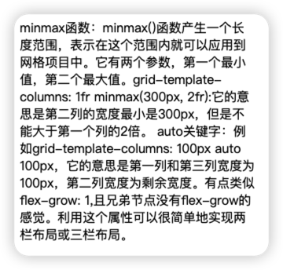
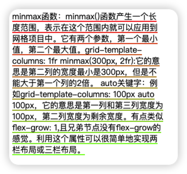
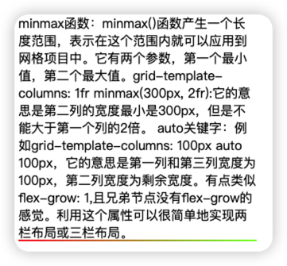

# 行内元素的动画
## 代码
```html
<!DOCTYPE html>
<html lang="en">
<head>
    <meta charset="UTF-8">
    <meta http-equiv="X-UA-Compatible" content="IE=edge">
    <meta name="viewport" content="width=device-width, initial-scale=1.0">
    <title>Document</title>
    <style>
        .span-outer {
            width: 300px;
        }
        .span-outer > span {
            background-image: linear-gradient(to right, red, rgb(115, 255, 0));
            background-position: left bottom;
            background-size: 0 2px;
            background-repeat: no-repeat;
            transition: background-size .4s linear;
        }
        .span-outer > span:hover {
            background-size: 100% 2px;
            /* background-position-x: right; */

        }
    </style>
</head>
<body>
    <div class="span-outer">
        <span>
            minmax函数：minmax()函数产生一个长度范围，表示在这个范围内就可以应用到网格项目中。它有两个参数，第一个最小值，第二个最大值。grid-template-columns: 1fr minmax(300px, 2fr):它的意思是第二列的宽度最小是300px，但是不能大于第一个列的2倍。
            auto关键字：例如grid-template-columns: 100px auto 100px，它的意思是第一列和第三列宽度为100px，第二列宽度为剩余宽度。有点类似flex-grow: 1,且兄弟节点没有flex-grow的感觉。利用这个属性可以很简单地实现两栏布局或三栏布局。
        </span>
    </div>
    
</body>
</html>
```
## 移入前

## 行内元素移入后

## 设置成块级元素移入后

## 结论
针对行内元素的动画，可以理解成把它平铺成一个块级元素，设置动画后，然后按照内容进行切割。
