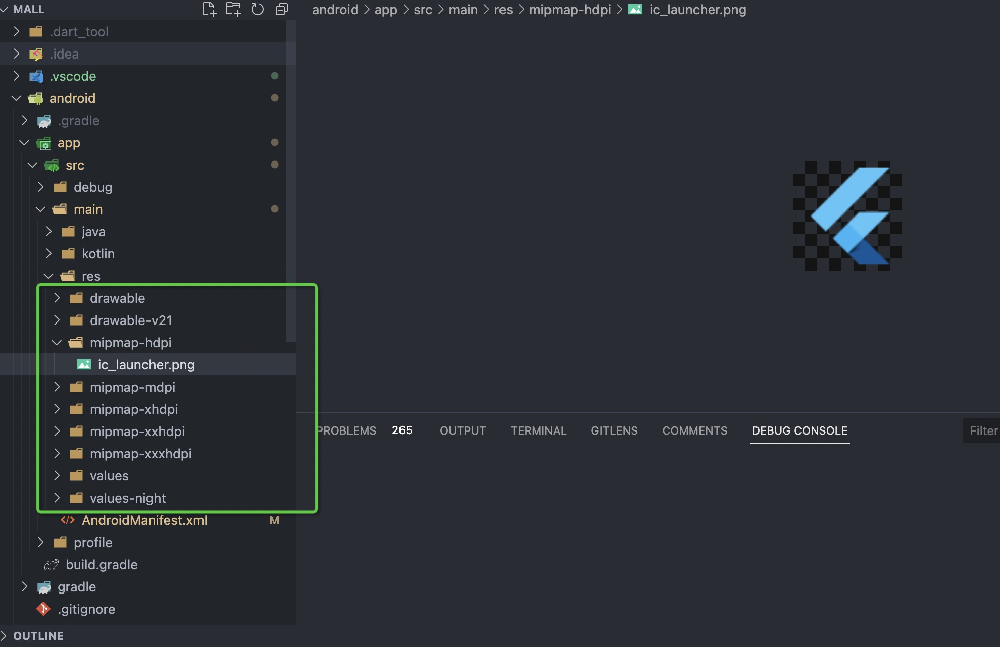
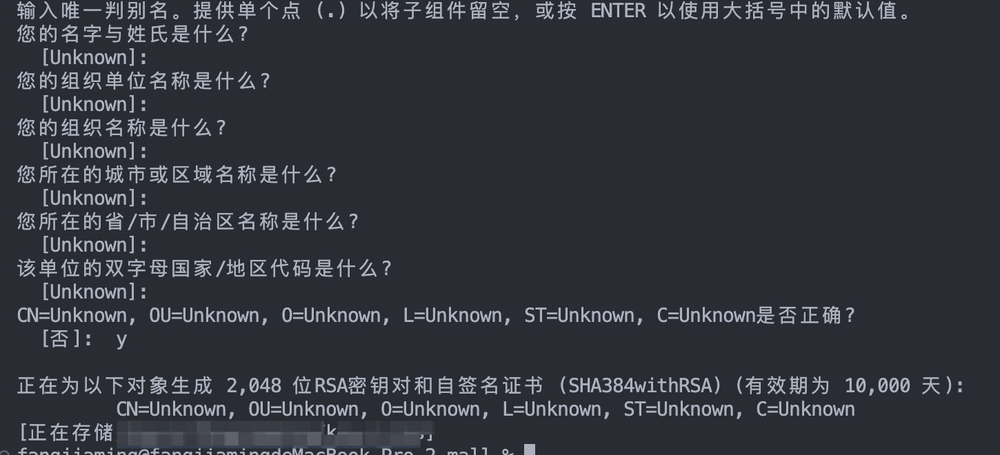
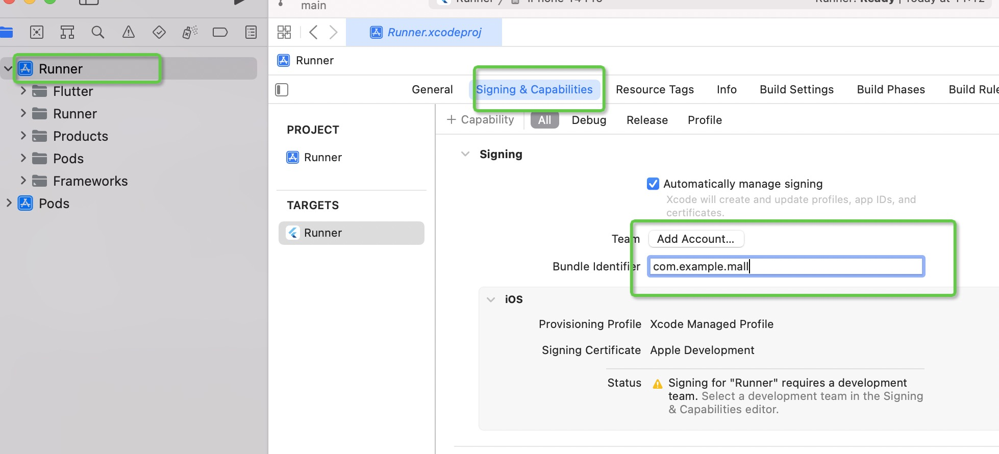

# flutter打包
1. 打包前，首先需要将App的名称和图片进行修改
2. 其次增加一些功能授权，确保打包后的文件安装时可用的
## 基础配置
### Android
1. 打开项目路径下的`android/app/src/main/AndroidManifest.xml`文件
2. 找到`android:label`字段，此字段表示为app在手机应用内的名称。
3. 找到`android:icon`字段，此字段为手机中的图标，可以修改图片的名字，图片文件存储于`android/app/src/main/res`中。

4. 配置功能授权，在`<manifest></manifest>`中添加如下配置，可自定义。
```xml
<uses-permission android:name="android.permission.READ_PHONE_STATE"/>
<uses-permission android:name="android.permission.INTERNET"/>
<uses-permission android:name="android.permission.ACCESS_NETWORK_STATE"/>
<uses-permission android:name="android.permission.ACCESS_NETWORK_STATE"/>
```
### IOS
1. 打开ios/Runner/info.plist文件，找到`CFBundelName`的key，然后修改key的值
```xml
<key>CFBundleName</key>
<string>我的第一个flutter应用</string>
```
2. 图标的配置在`ios/Runner/Assets.xcassets/AppIcon.appiconset/Contents.json`文件下，自定义修改即可。
3. 增加自己所需授权
```xml
<key>NSBluetoothPeripheralUsageDescription</key>
<string>需要在打印的时候访问蓝牙功能</string>
<key>NSCalendarsUsageDescription</key>
<string>需要在查看信息的时候访问日历</string>
```

## 打包发布
### Android
1. 确认`keytool`是否安装。
2. 创建`keystore`，运行如下命令
```
keytool -genkey -v -keystore ~/key.jks -keyalg RSA -keysize 2048 -validity 10000 -ali
as key
```
输入该命令后，会填写各种信息，其中密码比较关键，其他随意。  
如下为成功效果：  

3. 引用`keystore`生成`key.properties`，在android目录下创建`key.properties`文件，配置如下信息：
```
storePassword=密码
keyPassword=密码
keyAlias=key
storeFile=存储路径
```
4. 配置签名，打开`android/app/build.gradle`文件，找到`android {`位置，加入如下代码：
```javascript
def keystorePropertiesFile=rootProject.file("key.properties")
def keystoreProperties=new Properties()
keystoreProperties.load(new FileInputStream(keystorePropertiesFile))
android {
```
5. 同上文件，找到`buildTypes`,加入如下配置：
```
signingConfigs {
    release {
        keyAlias keystoreProperties['keyAlias']
        keyPassword keystoreProperties['keyPassword']
        storeFile file(keystoreProperties['storeFile'])
        storePassword keystoreProperties['storePassword']
    }
}
buildTypes {
```
6. 混淆代码包，类似JS压缩。
* 创建`android/app/proguard-rule.pro`文件，可以参考如下配置。
```
#Flutter Wrapper
-keep class io.flutter.app.** { *; }
-keep class io.flutter.plugin.** { *; }
-keep class io.flutter.util.** { *; }
-keep class io.flutter.view.** { *; }
-keep class io.flutter.** { *; }
-keep class io.flutter.plugins.** { *; }
```
* 然后在`android/app/build.gradle`中加入
```
buildTypes {
    release {
        // TODO: Add your own signing config for the release build.
        // Signing with the debug keys for now, so `flutter run --release` works.
        signingConfig signingConfigs.debug
        // 资源压缩设置
        minifyEnabled true
        // 代码压缩设置
        useProguard true
        // 读取代码压缩配置文件
        proguardFiles getDefaultProguardFile('proguard-android.txt'),'proguard-rules.pro'
    }
}
```
7. 运行打包命令
```
flutter build apk --release
```
8. 如果要安装到手机上，可以运行`flutter install`，然后选择要安装的设备。

### IOS打包
#### 前提
* Xcode，如果不是mac系统，则需要先安装虚拟机，然后安装mac系统
* 苹果开发者账号，需要下载苹果的开发者APP，认证后创建项目，并设置一个Bundle Id。

1. 打开Xcode，并打开项目下的ios目录。
2. 点击Runner，选择`Signing & Capabilities`，并修改bundle identifier，这个值就是开发者App里面设置的Bundle Id。

3. 回到项目根目录，运行`flutter build ios`。
4. 回到Xcode，配置如下信息，并上传安装包，就可以在开发者App中查看。

## 参考
[Flutter快学快讲24讲](https://www.bilibili.com/video/BV1ZV4y1W7Z5/?p=19&spm_id_from=333.880.my_history.page.click&vd_source=caaa3b8d70ac65eab5c971d1a03641f3)
