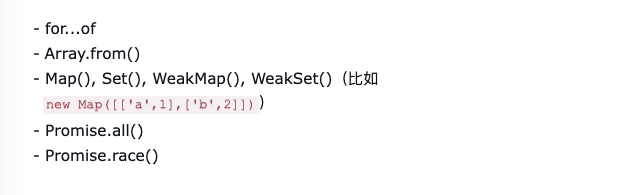
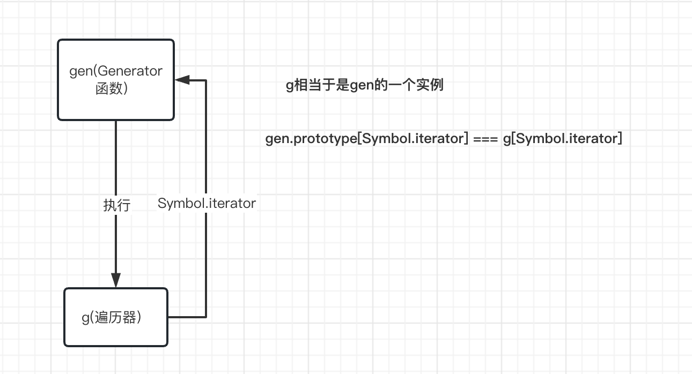

# Iterator和Generator详解

### Iterator（遍历器）

<a name="VgjEW"></a>

#### 概念：

它是一种接口，为各种不同的数据结构提供统一的访问机制。任何数据结构只要部署 Iterator 接口，就可以完成遍历操作（即依次处理该数据结构的所有成员）。
<a name="b20NR"></a>

#### 作用：

Iterator 的作用有三个：一是为各种数据结构，提供一个统一的、简便的访问接口；二是使得数据结构的成员能够按某种次序排列；三是 ES6 创造了一种新的遍历命令`for...of`循环，Iterator 接口主要供`for...of`消费。
<a name="Xwsvf"></a>

#### 遍历过程：

1. 首先创建一个指针对象，指向当前数据结构的起始位置。（该指针对象会存在一个`next`方法）
2. 调用指针对象的 next 方法，它会返回一个对象，包含两个属性：value 和 done，done 类型为布尔类型，表示遍历是否结束。（done 默认为 false，value 默认为 undefined）
3. 循环遍历，知道 done 属性为 true。

```javascript
let xiaoming = {
    name: "小明",
    age: 18,
};
xiaoming[Symbol.iterator] = function () {
    let data = Object.entries(xiaoming);
    let index = 0;
    return {
        next() {
            return index < data.length
                ? {
                      value: data[index++],
                      done: false,
                  }
                : {
                      value: undefined,
                      done: true,
                  };
        },
    };
};
console.log([...xiaoming]); // [ [ 'name', '小明' ], [ 'age', 18 ] ]
```

<a name="vFPg6"></a>

#### JS 中原生具备 Iterator 接口的数据结构

-   Array
-   Map
-   Set
-   String
-   TypedArray
-   函数中的 arguments 对象
-   NodeList 对象
    <a name="CMZEq"></a>

#### 调用 Iterator 接口的场合

1. 解构赋值

```javascript
let set = new Set().add("a").add("b").add("c");

let [x, y] = set;
// x='a'; y='b'

let [first, ...rest] = set;
// first='a'; rest=['b','c'];
```

2. 拓展运算法

```javascript
// 例一
var str = "hello";
[...str]; //  ['h','e','l','l','o']

// 例二
let arr = ["b", "c"];
["a", ...arr, "d"];
// ['a', 'b', 'c', 'd']
```

3. yield\*

`yield*`后面跟的是一个可遍历的结构，它会调用该结构的遍历器接口。

```javascript
let generator = function* () {
    yield 1;
    yield* [2, 3, 4];
    yield 5;
};

var iterator = generator();

iterator.next(); // { value: 1, done: false }
iterator.next(); // { value: 2, done: false }
iterator.next(); // { value: 3, done: false }
iterator.next(); // { value: 4, done: false }
iterator.next(); // { value: 5, done: false }
iterator.next(); // { value: undefined, done: true }
```

4. 其他场合

由于数组的遍历会调用遍历器接口，所以任何接受数组作为参数的场合，其实都调用了遍历器接口。下面是一些例子。<br />
<a name="BSzma"></a>

#### Iterator 接口与 Generator 函数

Symbol.iterator()方法的最简单实现，还是使用下一章要介绍的 Generator 函数。

```javascript
let myIterable = {
    [Symbol.iterator]: function* () {
        yield 1;
        yield 2;
        yield 3;
    },
};
[...myIterable]; // [1, 2, 3]

// 或者采用下面的简洁写法

let obj = {
    *[Symbol.iterator]() {
        yield "hello";
        yield "world";
    },
};

for (let x of obj) {
    console.log(x);
}
// "hello"
// "world"
```

<a name="oRqJk"></a>

#### 遍历器对象的 return()，throw()

遍历器对象还有两个方法`return`、`throw`，但是这两个方法是可选的，而 next 方法是必须的。

-   return()方法的使用场合是，如果 for...of 循环提前退出（通常是因为出错，或者有 break 语句），就会调用 return()方法。如果一个对象在完成遍历前，需要清理或释放资源，就可以部署 return()方法。
    <a name="I6peg"></a>

### Array.from

**Array.from()** 方法对一个`类数组`或`可迭代对象`创建一个新的，浅拷贝的`数组`实例。
<a name="H57WW"></a>

#### 参数

`arrayLike`：想要转换成数组的类数组对象或可迭代对象。<br />`mapFn（可选）`：如果指定了该参数，新数组中的没个元素都会执行该回调函数，回调函数里面形参：element,index。<br />`thisArg(可选）`：可选参数，执行回调函数 mapFn 的 this 对象。
<a name="n2dN0"></a>

#### 语法

```javascript
// 箭头函数
Array.from(arrayLike, (element) => {
    /* … */
});
Array.from(arrayLike, (element, index) => {
    /* … */
});

// 映射函数
Array.from(arrayLike, mapFn);
Array.from(arrayLike, mapFn, thisArg);

// 内联映射函数
Array.from(arrayLike, function mapFn(element) {
    /* … */
});
Array.from(arrayLike, function mapFn(element, index) {
    /* … */
});
Array.from(
    arrayLike,
    function mapFn(element) {
        /* … */
    },
    thisArg
);
Array.from(
    arrayLike,
    function mapFn(element, index) {
        /* … */
    },
    thisArg
);
```

<a name="FLCTW"></a>

### Generator 函数语法

<a name="dyQCV"></a>

#### 概念

Generator 函数可以理解成一个状态机，内部封装了多种状态。执行 Generator 函数会返回一个 Iterator 对象。

```javascript
function* handleGenerator() {
    console.log(123);
    yield "start";
    console.log(123);

    yield "pending";
    console.log(123);

    return "ending";
}

var iterator = handleGenerator();
```

上面的代码定义了一个 Generator 函数，它的内部有三个状态 start、pending、ending。在 handleGenerator 函数执行之后，它内部的代码并不执行，直到执行了返回的 Iterator 对象的 next 函数，才会执行部分函数。<br />执行顺序可以理解为：每次调用`next`方法，内部指针就从函数头部或上一次停下来的地方开始执行，直到遇到下一个`yield`表达式（或`return`语句）为止。换言之，Generator 函数是分段执行的，`yield`表达式是暂停执行的标记，而`next`方法可以恢复执行。
<a name="V3wB2"></a>

#### yield 表达式(只能用在 Generator 函数内）

因为 Generator 函数返回的是一个遍历器，所以只有调用 next 方法才会遍历下一个状态，而`yield`关键字相当于隔断每个执行区域。<br />遍历器对象的 next 方法运行逻辑如下：

1. 遇到 yield 表达式，就暂停后面的代码块执行，并将 yeild 后面的值返回到 value 属性中。
2. 下一次调用 yield 时，会重复步骤 1 里面的操作。
3. 如果没有遇到 yield 表达式，就一直运行到函数结束，直到 return 语句，最后将 return 语句的值返回至 value 中，并将 done 设为 true。
4. 如果没有 return 语句，则将 value 设为 undefined，done 为 true。
   <a name="tPeRA"></a>

#### Generator 函数与遍历器的关系

```javascript
function* gen() {
    // some code
}

var g = gen();

g[Symbol.iterator]() === g;
// true
```

<br />上面代码中，gen 是一个 Generator 函数，调用它会生成一个遍历器对象 g。它的 Symbol.iterator 属性，也是一个遍历器对象生成函数，执行后返回它 gen 自己。
<a name="B4FZ2"></a>

#### next 方法参数

```javascript
function* foo(x) {
    var y = 2 * (yield x + 1);
    var z = yield y / 3;
    return x + y + z;
}

var a = foo(5);
a.next(); // Object{value:6, done:false}
a.next(); // Object{value:NaN, done:false}
a.next(); // Object{value:NaN, done:true}

var b = foo(5);
b.next(); // { value:6, done:false }
b.next(12); // { value:8, done:false }
b.next(13); // { value:42, done:true }
```

yield 默认返回参数为 undefined，如果 next 进行传参，则返回参数为 next 方法的实参。
<a name="cKqYG"></a>

#### yield\* 表达式

主要作用是在一个 Generator 函数内调用了另一个 Generator 函数，不用手动去执行另一个遍历器。可以当做`for...of`的简写形式。<br />**手动执行：**

```javascript
function* foo() {
    yield "a";
    yield "b";
}

function* bar() {
    yield "x";
    // 手动遍历 foo()
    for (let i of foo()) {
        console.log(i);
    }
    yield "y";
}

for (let v of bar()) {
    console.log(v);
}
// x a b y
```

**自动执行：**

```javascript
function* foo() {
    yield "a";
    yield "b";
}

function* bar() {
    yield "x";
    // 自动遍历
    yield* foo();
    yield "y";
}

for (let v of bar()) {
    console.log(v);
}
// x a b y
```

<a name="sisLk"></a>

#### 异步 Generator（实现 async、await）

简单实现 async、await

```javascript
function myAsync(gen) {
    const g = gen(); // 生成遍历器
    return new Promise((resolve, reject) => {
        function next(data) {
            const result = g.next(data); // 获取yield的结果
            if (result.done) return resolve(result.value); // 如果执行完成，则resolve
            Promise.resolve(result.value).then(
                function (res) {
                    next(res);
                },
                function (e) {
                    reject(e);
                }
            );
        }
        next(); // 进入函数默认执行一次，直到碰到yield。
    });
}
```

参考：  
[阮一峰es6入门](https://es6.ruanyifeng.com/#docs/iterator)