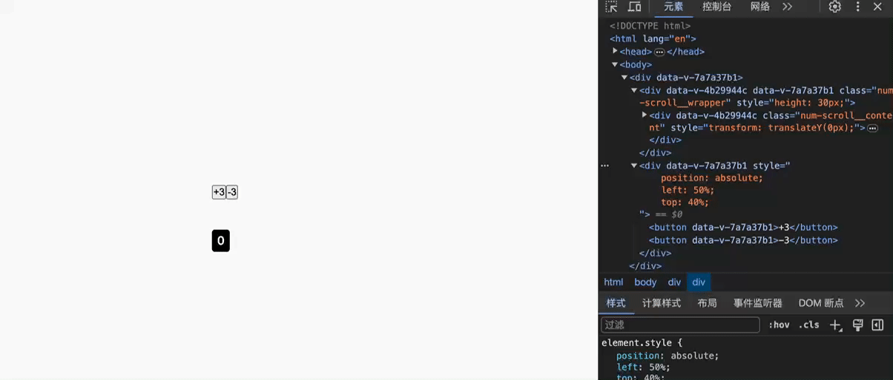

# 数字无限滚动组件
## 效果

## 代码
```vue
<template>
  <div
    class="num-scroll__wrapper"
    :style="{
      height: blockHeight + 'px',
    }"
  >
    <div class="num-scroll__content" ref="translateDom">
      <div v-for="(item, index) in numData" :key="index">
        {{ item }}
      </div>
      <div v-for="(item, index) in numData" :key="index + '_'">
        {{ item }}
      </div>
    </div>
  </div>
</template>

<script>
import anime from "animejs";
export default {
  data() {
    let numData = new Array(10).fill("").map((item, index) => index);
    return {
      numData: numData,
      curValue: 0,
      curPostion: 0, // 当前内容位移距离
      animeInstance: null,
    };
  },
  props: {
    value: {
      type: Number,
      default: 0,
    },
    blockHeight: {
      type: Number,
      default: 30,
    },
    duration: {
      type: Number,
      default: 1000,
    },
  },
  watch: {
    value: "run",
  },
  methods: {
    run() {
      let animeDom = this.$refs.translateDom;
      if (!animeDom) return;
      //   需要位移到的位置
      let translateY = -this.value * this.blockHeight;
      // 两种情况，一种是需要位移的值在当前值的上方，也就是需要往下滚动触发无限滚动逻辑
      // 第二种就是当前位移位置在需要移动到的位置的下方，也需要无限滚动
      if (this.value < this.curValue || translateY > this.curPostion) {
        const groupSize = 10;
        translateY = -this.blockHeight * (groupSize + this.value);
      }
      this.animeInstance && this.animeInstance.pause();
      this.animeInstance = anime({
        targets: animeDom,
        translateY,
        easing: "linear",
        duration: this.duration,
        update: (anim) => {
          let curTranslateY = anim.animations.find(
            (item) => item.property === "translateY"
          );
          if (!curTranslateY) return;
          this.curPostion = parseFloat(curTranslateY.currentValue);
        },
        complete: () => {
          this.curValue = this.value;
          this.animeInstance = null;
          this.resetPos();
        },
      });
    },
    resetPos() {
      let animeDom = this.$refs.translateDom;
      anime({
        targets: animeDom,
        translateY: -this.value * this.blockHeight,
        duration: 0,
        complete: () => {
          this.curPostion = -this.value * this.blockHeight;
        },
      });
    },
  },
  mounted() {
    this.run();
  },
};
</script>
<style scoped>
.num-scroll__wrapper {
  display: inline-block;
  text-align: center;
  overflow: hidden;
  background: #000;
  color: #fff;
  font-size: 16px;
  font-weight: bold;
  width: 24px;
  border-radius: 4px;
  height: 30px;
  line-height: 30px;
  position: fixed;
  left: 50%;
  top: 50%;
}
</style>
```
## 参考
-  [animejs官方文档](https://animejs.com/)