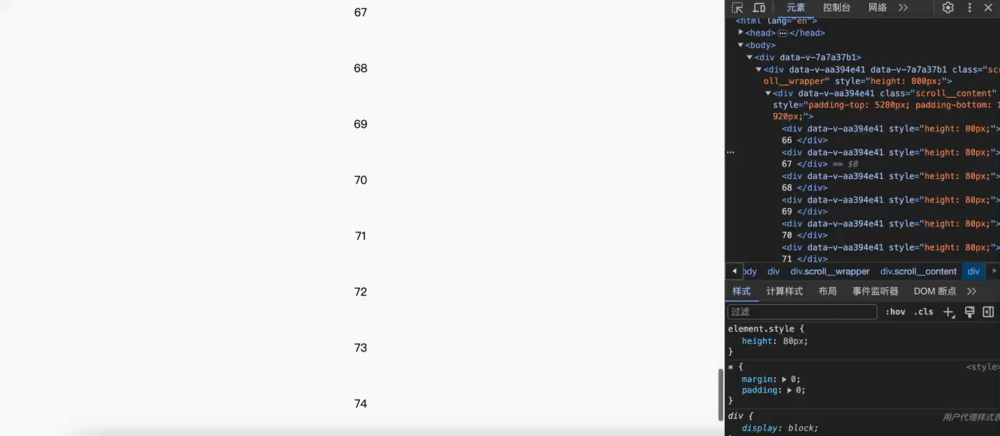

# 简单的虚拟滚动列表
## 效果

## 代码
```vue
<template>
  <div
    class="scroll__wrapper"
    :style="{ height: totalHeight + 'px', }"
    @scroll="handleScroll"
  >
    <div
      class="scroll__content"
      :style="{
        paddingTop: curScrllIndex * itemHeight + 'px',
        paddingBottom:
          (list.length - curScrllIndex - showSize) * itemHeight + 'px',
      }"
    >
      <div
        v-for="(item, index) in showList"
        :key="index"
        :style="{ height: itemHeight + 'px' }"
      >
        {{ item }}
      </div>
    </div>
  </div>
</template>

  <script>
export default {
  data() {
    return {
      curScrllIndex: 0,
    };
  },
  props: {
    list: {
        type: Array,
        default: () => new Array(100).fill("").map((item, index) => index)
    },
    itemHeight: {
      type: Number,
      default: 80,
    },
    showSize: {
      type: Number,
      default: 10,
    },
  },
  computed: {
    totalHeight() {
      return this.showSize * this.itemHeight;
    },
    showList() {
      return this.list.slice(
        this.curScrllIndex,
        this.curScrllIndex + this.showSize + 1
      );
    },
  },
  methods: {
    handleScroll(e) {
      let { currentTarget } = e;
      this.curScrllIndex = Math.floor(currentTarget.scrollTop / this.itemHeight);
    },
  },
  created() {},
};
</script>
  <style scoped>
.scroll__wrapper {
  overflow: scroll;
}
</style>
```