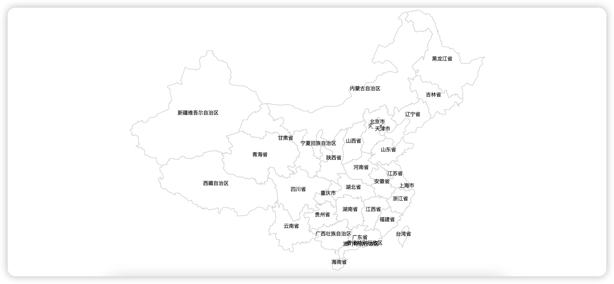
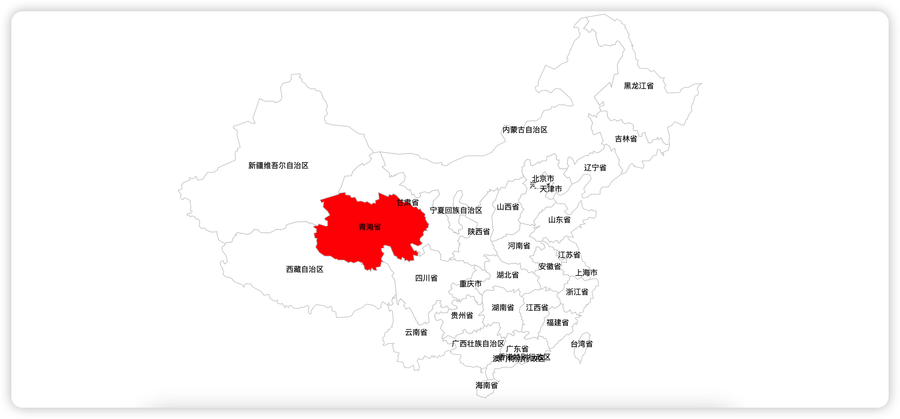
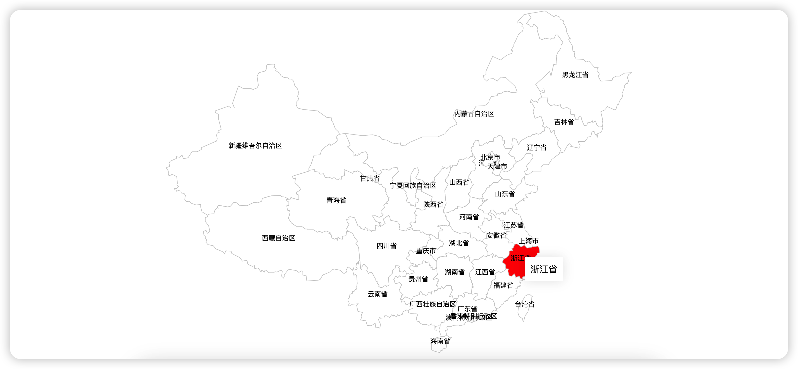

# d3绘制地图

## 步骤

1. 获取地图 GEOJSON 文件，可以通过[DATAV-地图选择器](http://datav.aliyun.com/portal/school/atlas/area_selector)获取。
2. 设置投影
3. 绑定 geojson 数据，并生成 path 路径
4. 绑定鼠标交互事件
5. 设置地图缩放和拖拽

## 绘制地图

### 1. 首先编写一个基础模板

```html
<!DOCTYPE html>
<html lang="en">
    <head>
        <meta charset="UTF-8" />
        <meta name="viewport" content="width=device-width, initial-scale=1.0" />
        <title>Document</title>
        <script src="https://cdn.bootcdn.net/ajax/libs/d3/7.8.4/d3.js"></script>
        <style>
            * {
                margin: 0;
                padding: 0;
            }
        </style>
    </head>
    <body>
        <svg class="bg"></svg>
        <script type="module">
            let svg = d3.select("svg");
            let width = svg.attr("width", window.innerWidth);
            let height = svg.attr("height", window.innerHeight);
            let padding = {
                left: 20,
                top: 20,
                right: 20,
                bottom: 20,
            };
        </script>
    </body>
</html>
```

### 2. 设置投影

目前有两种方式可以设置投影

-   手动设置缩放、中心点以及位移

```javascript
const projection = d3
    .geoMercator() //墨卡托投影
    .center([someValue, someValue]) //链式写法，.center([longitude, latitude])设置地图中心
    .scale([someValue]) //.scale([value])设置地图缩放
    .translate([someValue, someValue]); //.translate([x,y])设置偏移
```

-   传入左上角坐标、右下角坐标、地图数据，自动设置缩放。

```javascript
const x0 = padding;
const y0 = padding;
const x1 = svgWidth - padding * 2;
const y1 = svgHeight - padding * 2;
const projection = d3.geoMercator().fitExtent(
    [
        [x0, y0],
        [x1, y1],
    ],
    geoJson
);
```

这里我们采用第二种方式，比较方便：

```javascript
// 设置投影
const projection = d3.geoMercator().fitExtent(
    [
        [padding.left, padding.top],
        [
            window.innerWidth - padding.right,
            window.innerHeight - padding.bottom,
        ],
    ],
    data
);
```

### 3. 获取 path 路径生成函数

```javascript
// 获取路径生成器
const pathGenerator = d3.geoPath().projection(projection); //配置上投影
```

### 4. 创建 svg 分组并插入 path 以及 text。

```javascript
// 创建分组
const g = svg
    .selectAll("g")
    .data(data.features) //数据绑定
    .enter()
    .append("g");
// 插入路径
const mapPath = g
    .append("path")
    .attr("d", pathGenerator) //绘制path
    .attr("stroke-width", 1)
    .attr("stroke", "#ccc")
    .attr("fill", "#fff");
// 插入文本
g.append("text")
    .text((d) => {
        return d.properties.name;
    })
    .attr("x", (d) => {
        // 获取路径的中心点
        return pathGenerator.centroid(d)[0];
    })
    .attr("y", (d) => {
        return pathGenerator.centroid(d)[1];
    })
    .attr("text-anchor", "middle")
    .attr("fill", "#000")
    .style("font-size", 12);
```

效果：


### 5. 加入鼠标移入事件

```javascript
// 加上鼠标事件
g.on("mouseover", function () {
    d3.select(this).select("path").attr("fill", "red");
}).on("mouseout", function () {
    d3.select(this).select("path").attr("fill", "#fff");
});
```

效果：


### 6. 加入 toolTip

首先在 html 中加入 tooltip 的 dom，

```html
<div class="tooltip"></div>
```

加入鼠标移动事件

```javascript
g.on("mousemove", (e) => {
    d3.select(".tooltip")
        .style("display", "block")
        .style("left", `${e.pageX + 10}px`)
        .style("top", `${e.pageY + 10}px`)
        .text(e.target.__data__.properties.name);
});
```

记得在鼠标移出的时候将 tooltip 去除。

```javascript
g.on("mouseout", function () {
    d3.select(".tooltip").style("display", "none");
});
```

效果：


### 7. 加入拖拽和缩放事件

```javascript
function zoomed(e) {
    const t = e.transform;
    svg.attr("transform", `translate(${t.x}, ${t.y}) scale(${t.k})`);
}
const zoom = d3
    .zoom()
    .scaleExtent([1, 3]) //设置监听范围
    .on("zoom", zoomed); //设置监听事件

svg.call(zoom); //应用
```

## 完整代码

```html
<!DOCTYPE html>
<html lang="en">
    <head>
        <meta charset="UTF-8" />
        <meta name="viewport" content="width=device-width, initial-scale=1.0" />
        <title>Document</title>
        <script src="https://cdn.bootcdn.net/ajax/libs/d3/7.8.4/d3.js"></script>
        <style>
            * {
                margin: 0;
                padding: 0;
            }
            .tooltip {
                position: fixed;
                left: 0;
                top: 0;
                padding: 10px;
                display: none;
                box-shadow: 0 0 20px rgba(0, 0, 0, 0.1);
                background-color: #fff;
            }
        </style>
    </head>

    <body>
        <svg class="bg"></svg>
        <div class="tooltip"></div>
        <script type="module">
            let svg = d3.select("svg");
            let width = svg.attr("width", window.innerWidth);
            let height = svg.attr("height", window.innerHeight);
            let offset = 10;
            let padding = {
                left: 20,
                top: 20,
                right: 20,
                bottom: 20,
            };
            const x1 = window.innerWidth - padding.left * 2;
            const y1 = window.innerHeight - padding.top * 2;
            fetch("地图GEOJSON数据").then(async (res) => {
                let data = await res.json();
                // 设置投影
                const projection = d3.geoMercator().fitExtent(
                    [
                        [padding.left, padding.top],
                        [
                            window.innerWidth - padding.right,
                            window.innerHeight - padding.bottom,
                        ],
                    ],
                    data
                );
                // 获取路径生成器
                const pathGenerator = d3.geoPath().projection(projection); //配置上投影
                // 创建分组
                const g = svg
                    .selectAll("g")
                    .data(data.features) //数据绑定
                    .enter()
                    .append("g");
                // 插入路径
                const mapPath = g
                    .append("path")
                    .attr("d", pathGenerator) //绘制path
                    .attr("stroke-width", 1)
                    .attr("stroke", "#ccc")
                    .attr("fill", "#fff");
                // 插入文本
                g.append("text")
                    .text((d) => {
                        return d.properties.name;
                    })
                    .attr("x", (d) => {
                        // 获取路径的中心点x坐标
                        return pathGenerator.centroid(d)[0];
                    })
                    .attr("y", (d) => {
                        // 获取路径的中心点y坐标
                        return pathGenerator.centroid(d)[1];
                    })
                    .attr("text-anchor", "middle") // 文字居中
                    .attr("fill", "#000")
                    .style("font-size", 12);
                // 加上鼠标事件
                g.on("mouseover", function () {
                    d3.select(this).select("path").attr("fill", "red");
                }).on("mouseout", function () {
                    d3.select(this).select("path").attr("fill", "#fff");
                    d3.select(".tooltip").style("display", "none");
                });
                g.on("mousemove", (e) => {
                    d3.select(".tooltip")
                        .style("display", "block")
                        .style("left", `${e.pageX + 10}px`)
                        .style("top", `${e.pageY + 10}px`)
                        .text(e.target.__data__.properties.name);
                });

                function zoomed(e) {
                    const t = e.transform;
                    svg.attr(
                        "transform",
                        `translate(${t.x}, ${t.y}) scale(${t.k})`
                    );
                }
                const zoom = d3
                    .zoom()
                    .scaleExtent([1, 3]) //设置监听范围
                    .on("zoom", zoomed); //设置监听事件

                svg.call(zoom); //应用
            });
        </script>
        <style></style>
    </body>
</html>
```

## 参考
[d3官网](https://d3js.org/d3-selection/selecting#select)  
[使用d3.js绘制地图](https://juejin.cn/post/6844904021027733511?searchId=20230910125232A3416D336AD6CE1F0C9A#heading-7)