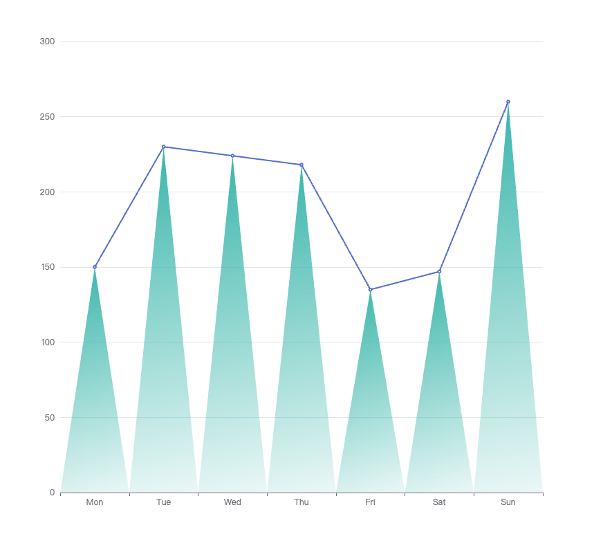

# echarts 如何自定义图形

## 实现效果

## 代码

```javascript
option = {
    xAxis: {
        type: "category",
        data: ["Mon", "Tue", "Wed", "Thu", "Fri", "Sat", "Sun"],
    },
    tooltip: {},
    yAxis: {
        type: "value",
    },
    series: [
        {
            data: [150, 230, 224, 218, 135, 147, 260],
            type: "line",
        },
        {
            type: "custom",
            renderItem: function (params, api) {
                // 获取给定点位映射到canvas上的坐标点位。
                let point = api.coord([api.value(0), api.value(1)]);
                // 获取横向坐标轴的宽度
                let size = api.size(0, 1)[0] / 2;
                let height = params.coordSys.y + params.coordSys.height;
                // 创建渐变色对象，用于图形渐变
                var color = new echarts.graphic.LinearGradient(0, 0, 1, 1, [
                    { offset: 0, color: "rgba(56, 181, 170,1)" },
                    { offset: 1, color: "rgba(56, 181, 170,.1)" },
                ]);
                return {
                    type: "polygon",
                    shape: {
                        // 设置点位
                        points: [
                            [point[0], point[1]],
                            [point[0] - size, height],
                            [point[0] + size, height],
                        ],
                    },
                    style: {
                        fill: color,
                    },
                };
            },
            data: [150, 230, 224, 218, 135, 147, 260],
        },
    ],
};
```
1. 主要是通过`series`里面`type`为`custom`来实现，其中有个`renderItem`方法，可以返回一个自定义图形对象。
2. `api.value(...)`，意思是取出 dataItem 中的数值。例如 `api.value(0)` 表示取出当前 dataItem 中第一个维度的数值。
3. `api.coord(...)`，意思是进行坐标转换计算。例如 `var point = api.coord([api.value(0), api.value(1)])` 表示 `dataItem` 中的数值转换成坐标系上的点。

## 坑点
1. 看官方文档里面`renderItem`返回的`style.fill`支持`string`格式，但是其实是可以支持`LinearGradient`对象的。
## 参考
[echarts自定义返回内容](https://echarts.apache.org/zh/option.html#series-custom.renderItem.return)