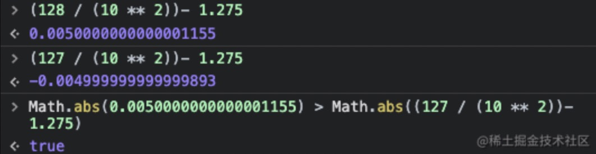
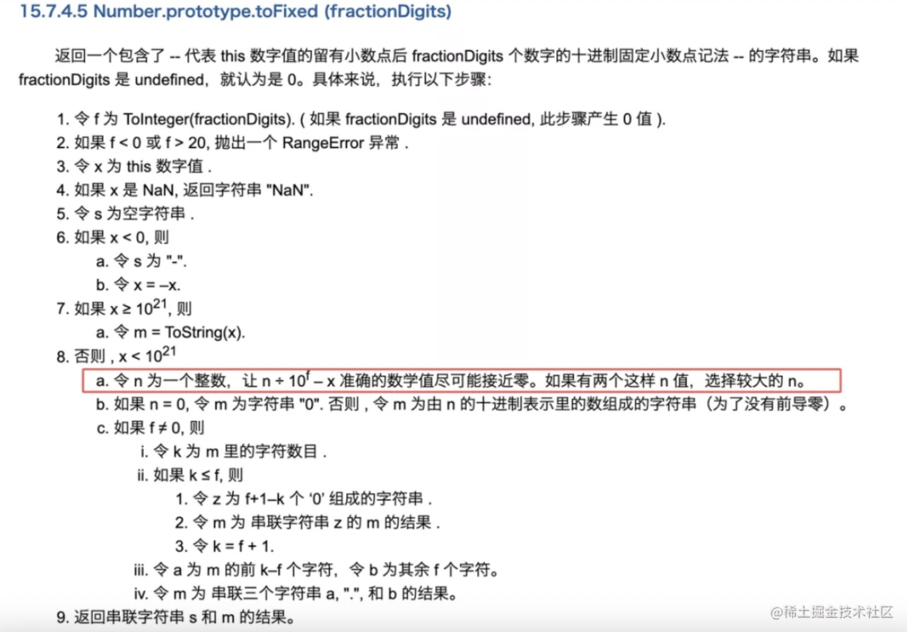

# js中toFixed的坑
1、toFixed不是遵循的`四舍五入`规范  
2、toFixed也不是遵循`银行家算法`   
3、toFixed规范：

解读：
**1：主要是针对8这一条。**  
如果数字小于10\*\*21的话：  
expamle: 1.275.toFixed(2)  
首先取两个`整数`，n1 = 127和n2 = 128  
n 为 整数，向上和向下,f为toFixed参数,此时为2，x则为1.275。

  
所以根据规则，128比127距离0远，取127，所对应的就是1.27。  
如果两个数量为一样的，则取更大的那一个。  
**2：如果x小于0的话，则会取-x,然后重复进行8这一条的计算。**