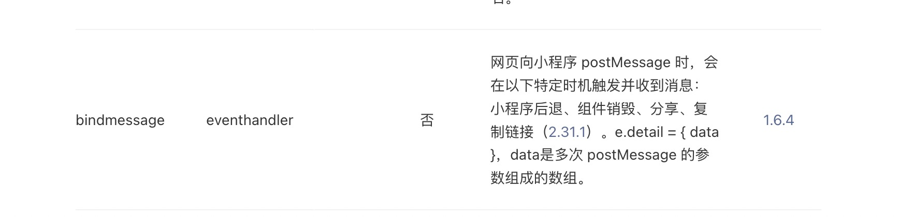

# 微信小程序web-view通信的坑

## 坑点
微信小程序中使用web-view无法使用postmessage做到实时通信，支付宝小程序支持
## 原因
微信小程序只会在特定情况下触发message事件，

## 解决方案
1. 首先在A页面（web-view承载页）中定义一个函数命名为`callback`;
```javascript
callback(data) {
    console.log(data, 'web-view通信参数');
},
```
2. 创建一个B页面，主要作用是当H5跳转到`B页面`时，拿到参数，然后执行`A页面`的`callback`函数。
```javascript
onLoad(options) {
    let routes = getCurrentPages();
    let route = routes[routes.length - 2];
    // 拿到web-view页面实例，并执行callback
    route.callback(options);
    wx.navigateBack()
}
```
3. 在H5中定义一个触发事件方法，跳转到B页面并传入所需参数即可。
```javascript
wx.miniProgram.navigateTo({
    // 可写入其他参数
    url: "/pages/logs/logs?name=123&age=456"
})
```
## 存在问题
页面会闪动，暂时没有想到其他解决办法
## 参考
-  [微信小程序web-view文档](https://developers.weixin.qq.com/miniprogram/dev/component/web-view.html)