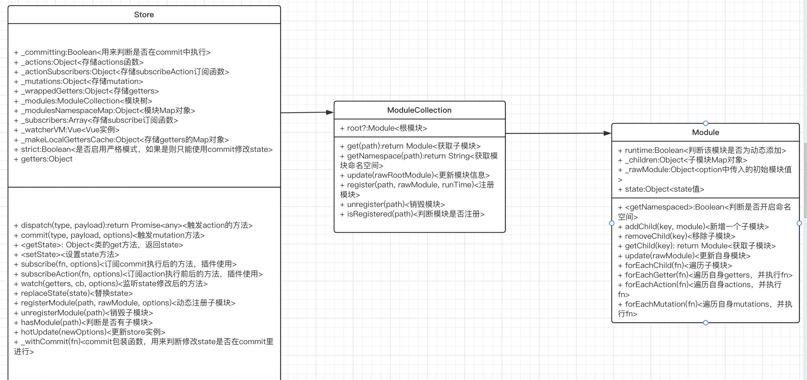

# vuex(3.6.2 版本)

## 准备工作

```
git clone git@github.com:vuejs/vuex.git
cd vuex
npm i
```

## install 函数解析

`vue2`使用`Vue.mixin`，给`beforeCreate`的生命周期里面混入`vuexInit`方法，判断`$options`上是否存在`store`对象，或者获取父组件的`$store`。  
`vue1`使用重新`_init`方法来解决。
关键代码:

```javascript
let Vue; // bind on install
export function install(_Vue) {
    // 如果Vue已经安装过，则报错
    if (Vue && _Vue === Vue) {
        if (__DEV__) {
            console.error(
                "[vuex] already installed. Vue.use(Vuex) should be called only once."
            );
        }
        return;
    }
    Vue = _Vue;
    applyMixin(Vue);
}
function applyMixin(Vue) {
    // 获取Vue版本号
    const version = Number(Vue.version.split(".")[0]);
    // 如果Vue版本大于2，则使用混入方法
    if (version >= 2) {
        Vue.mixin({ beforeCreate: vuexInit });
    } else {
        // override init and inject vuex init procedure
        // for 1.x backwards compatibility.
        const _init = Vue.prototype._init;
        Vue.prototype._init = function (options = {}) {
            options.init = options.init
                ? [vuexInit].concat(options.init)
                : vuexInit;
            _init.call(this, options);
        };
    }
}
function vuexInit() {
    const options = this.$options;
    // store injection
    // 注入$store对象
    if (options.store) {
        this.$store =
            typeof options.store === "function"
                ? options.store()
                : options.store;
    } else if (options.parent && options.parent.$store) {
        this.$store = options.parent.$store;
    }
}
```

## Store 解析

### 主流程

1. 拿到 options 后之后初始化对象属性以及\_modules，得到一个 ModuleCollection 的实例，他的 root 是 Module 的实例。
2. 将 commit 方法和 dispatch 绑定上 this 对象。
3. 执行 installModule 方法：填充 state 对象，初始化\_actions、\_mutations、\_wrappedGetters，并递归执行子模块
    1. 注册命名空间的 map 对象。
    2. 如果不是根对象，则进行赋值
    3. 创建一个带命名空间的 dispatch 方法和 commit 方法，比如 user 子模块使用 updateName，会被解析成 user/updateName，并进行执行。
    4. 遍历 mutation、action、getters，并赋值给\_mutations 等属性。
    5. 遍历 modules 对象，并递归执行 installModule。
4. 执行 resetStoreVM 方法：初始化 Vue 实例，使 state 以及 getters 变成响应式
    1. 获取老的 vm 实例
    2. 遍历_wrappedGetters，将 computed 对象填充为一个个函数，并定义 store.getters 中属性的 get 方法，使其等于 vm 的属性。
    3. 实例一个 vue 实例，data 指向 state，computed 指向上一步所定义的函数对象。
    4. 如果老的 vm 实例存在，则在下一个事件循环中销毁。
5. 遍历 options 中的 plugins，并使 store 作为实参传入函数执行。
6. 执行 devtoolPlugin 插件。

### 类关系图



### Store 类

```javascript
export class Store {
    constructor(options = {}) {
        // Auto install if it is not done yet and `window` has `Vue`.
        // To allow users to avoid auto-installation in some cases,
        // this code should be placed here. See #731
        // 如果未使用Vue.use方法，且window.Vue存在，则自动安装
        if (!Vue && typeof window !== "undefined" && window.Vue) {
            install(window.Vue);
        }
        // 如果为开发环境，则对特殊情况进行处理
        if (__DEV__) {
            assert(
                Vue,
                `must call Vue.use(Vuex) before creating a store instance.`
            );
            assert(
                typeof Promise !== "undefined",
                `vuex requires a Promise polyfill in this browser.`
            );
            assert(
                this instanceof Store,
                `store must be called with the new operator.`
            );
        }

        const { plugins = [], strict = false } = options;

        // store internal state
        // 用来判断是否在commit函数中执行的flag
        this._committing = false;
        // 用来存储二次包装过的actions
        this._actions = Object.create(null);
        // 存储subscribeAction订阅的函数
        this._actionSubscribers = [];
        // 用来存储二次包装过的mutations
        this._mutations = Object.create(null);
        // 用来存储二次包装过的getters
        this._wrappedGetters = Object.create(null);
        // ModuleCollection的实例，他的root指向Module实例，一个store实例只会有一个ModuleCollection实例。
        this._modules = new ModuleCollection(options);
        // 存储命名空间的Module实例的Map对象
        this._modulesNamespaceMap = Object.create(null);
        // 存储subscribe方法订阅的函数，会在commit方法执行之后执行。
        this._subscribers = [];
        // 一个vm实例
        this._watcherVM = new Vue();
        // getters缓存
        this._makeLocalGettersCache = Object.create(null);

        // bind commit and dispatch to self
        // 绑定this对象
        const store = this;
        const { dispatch, commit } = this;
        this.dispatch = function boundDispatch(type, payload) {
            return dispatch.call(store, type, payload);
        };
        this.commit = function boundCommit(type, payload, options) {
            return commit.call(store, type, payload, options);
        };

        // strict mode
        // 严格模式(开启后不允许通过commit之外的方法来修改state)
        this.strict = strict;
        // 获取根state对象
        const state = this._modules.root.state;
        // 填充state对象，初始化_actions、_mutations、_wrappedGetters，并递归执行子模块
        installModule(this, state, [], this._modules.root);
        // 初始化Vue实例，使state以及getters变成响应式
        resetStoreVM(this, state);
        // 引入插件
        plugins.forEach((plugin) => plugin(this));
        // vue.js devtools相关
        const useDevtools =
            options.devtools !== undefined
                ? options.devtools
                : Vue.config.devtools;
        if (useDevtools) {
            devtoolPlugin(this);
        }
    }
    // 获取初始state
    get state() {
        return this._vm._data.$$state;
    }
    // 设置state提示
    set state(v) {
        if (__DEV__) {
            assert(
                false,
                `use store.replaceState() to explicit replace store state.`
            );
        }
    }
    // 执行mutation方法
    commit(_type, _payload, _options) {
        // 处理入参，返回统一格式
        const { type, payload, options } = unifyObjectStyle(
            _type,
            _payload,
            _options
        );

        const mutation = { type, payload };
        // 获取函数数组
        const entry = this._mutations[type];
        if (!entry) {
            if (__DEV__) {
                console.error(`[vuex] unknown mutation type: ${type}`);
            }
            return;
        }
        // 执行commit数组
        this._withCommit(() => {
            entry.forEach(function commitIterator(handler) {
                handler(payload);
            });
        });
        // 执行subscribers数组
        this._subscribers
            .slice() // shallow copy to prevent iterator invalidation if subscriber synchronously calls unsubscribe
            .forEach((sub) => sub(mutation, this.state));

        if (__DEV__ && options && options.silent) {
            console.warn(
                `[vuex] mutation type: ${type}. Silent option has been removed. ` +
                    "Use the filter functionality in the vue-devtools"
            );
        }
    }
    // 执行action
    dispatch(_type, _payload) {
        // 处理入参，返回统一格式
        const { type, payload } = unifyObjectStyle(_type, _payload);
        const action = { type, payload };
        const entry = this._actions[type];
        if (!entry) {
            if (__DEV__) {
                console.error(`[vuex] unknown action type: ${type}`);
            }
            return;
        }
        try {
            // 执行订阅函数中before函数
            this._actionSubscribers
                .slice() // shallow copy to prevent iterator invalidation if subscriber synchronously calls unsubscribe
                .filter((sub) => sub.before)
                .forEach((sub) => sub.before(action, this.state));
        } catch (e) {
            if (__DEV__) {
                console.warn(`[vuex] error in before action subscribers: `);
                console.error(e);
            }
        }

        const result =
            entry.length > 1
                ? Promise.all(entry.map((handler) => handler(payload)))
                : entry[0](payload);

        return new Promise((resolve, reject) => {
            result.then(
                (res) => {
                    try {
                        // 执行类别为after的订阅函数
                        this._actionSubscribers
                            .filter((sub) => sub.after)
                            .forEach((sub) => sub.after(action, this.state));
                    } catch (e) {
                        if (__DEV__) {
                            console.warn(
                                `[vuex] error in after action subscribers: `
                            );
                            console.error(e);
                        }
                    }
                    resolve(res);
                },
                (error) => {
                    try {
                        this._actionSubscribers
                            .filter((sub) => sub.error)
                            .forEach((sub) =>
                                sub.error(action, this.state, error)
                            );
                    } catch (e) {
                        if (__DEV__) {
                            console.warn(
                                `[vuex] error in error action subscribers: `
                            );
                            console.error(e);
                        }
                    }
                    reject(error);
                }
            );
        });
    }
    // 订阅commit函数
    subscribe(fn, options) {
        return genericSubscribe(fn, this._subscribers, options);
    }
    // 订阅action函数
    subscribeAction(fn, options) {
        const subs = typeof fn === "function" ? { before: fn } : fn;
        return genericSubscribe(subs, this._actionSubscribers, options);
    }
    // 监听函数
    watch(getter, cb, options) {
        if (__DEV__) {
            assert(
                typeof getter === "function",
                `store.watch only accepts a function.`
            );
        }
        return this._watcherVM.$watch(
            () => getter(this.state, this.getters),
            cb,
            options
        );
    }
    // 替换state
    replaceState(state) {
        this._withCommit(() => {
            this._vm._data.$$state = state;
        });
    }
    // 动态注册模块
    registerModule(path, rawModule, options = {}) {
        if (typeof path === "string") path = [path];

        if (__DEV__) {
            assert(
                Array.isArray(path),
                `module path must be a string or an Array.`
            );
            assert(
                path.length > 0,
                "cannot register the root module by using registerModule."
            );
        }

        this._modules.register(path, rawModule);
        installModule(
            this,
            this.state,
            path,
            this._modules.get(path),
            options.preserveState
        );
        // reset store to update getters...
        resetStoreVM(this, this.state);
    }

    unregisterModule(path) {
        if (typeof path === "string") path = [path];

        if (__DEV__) {
            assert(
                Array.isArray(path),
                `module path must be a string or an Array.`
            );
        }

        this._modules.unregister(path);
        this._withCommit(() => {
            // 获取父状态
            const parentState = getNestedState(this.state, path.slice(0, -1));
            // 删除父状态下的属性
            Vue.delete(parentState, path[path.length - 1]);
        });
        resetStore(this);
    }

    hasModule(path) {
        if (typeof path === "string") path = [path];

        if (__DEV__) {
            assert(
                Array.isArray(path),
                `module path must be a string or an Array.`
            );
        }

        return this._modules.isRegistered(path);
    }
    // 更新模块
    hotUpdate(newOptions) {
        this._modules.update(newOptions);
        resetStore(this, true);
    }
    // 包装commit函数，作用是为了让严格模式下修改只能在commit函数中进行，否则报错
    _withCommit(fn) {
        const committing = this._committing;
        this._committing = true;
        fn();
        this._committing = committing;
    }
}
```

## 辅助函数解析

### mapState 解析

```javascript
export const mapState = normalizeNamespace((namespace, states) => {
    const res = {};
    // 如果states不是对象或者数组
    if (__DEV__ && !isValidMap(states)) {
        console.error(
            "[vuex] mapState: mapper parameter must be either an Array or an Object"
        );
    }
    // 统一入参并遍历
    normalizeMap(states).forEach(({ key, val }) => {
        res[key] = function mappedState() {
            let state = this.$store.state;
            let getters = this.$store.getters;
            // 如果第一个参数指定了命名空间，例如mapState("app", ["name"])
            if (namespace) {
                // 获取命名空间下的module
                const module = getModuleByNamespace(
                    this.$store,
                    "mapState",
                    namespace
                );
                if (!module) {
                    return;
                }
                // 将state赋值为context下的state
                state = module.context.state;
                // 将getters赋值为context下的getters
                getters = module.context.getters;
            }
            // 如果为函数的话，则传入state以及getters，并执行
            return typeof val === "function"
                ? val.call(this, state, getters)
                : state[val];
        };
        // mark vuex getter for devtools
        res[key].vuex = true;
    });
    return res;
});
```

### mapMutations解析

```javascript
export const mapMutations = normalizeNamespace((namespace, mutations) => {
    const res = {};
    // 检验对象或数组
    if (__DEV__ && !isValidMap(mutations)) {
        console.error(
            "[vuex] mapMutations: mapper parameter must be either an Array or an Object"
        );
    }
    // 统一入参并遍历
    normalizeMap(mutations).forEach(({ key, val }) => {
        res[key] = function mappedMutation(...args) {
            // Get the commit method from store
            let commit = this.$store.commit;
            // 如果存在命名空间的话，则获取module下的commit方法
            if (namespace) {
                const module = getModuleByNamespace(
                    this.$store,
                    "mapMutations",
                    namespace
                );
                if (!module) {
                    return;
                }
                commit = module.context.commit;
            }
            // 如果为函数，则第一个参数出入commit并执行
            return typeof val === "function"
                ? val.apply(this, [commit].concat(args))
                : commit.apply(this.$store, [val].concat(args));
        };
    });
    return res;
});
```
### mapGetters解析（和state类似，除了不能传入函数）
### mapActions(和mapMutations类似)

## 总结
1. install方法保存Vue构造函数，并用beforeCreate生命周期注入$store,之后可以应用到自己开发的vue库中。
2. 着重理解上下文，可以针对不同的模块存储不同的上下文（vuex中的context对象），并针对每个上下文存储不同的属性函数，例如vuex中的state、getters属性，commit函数。