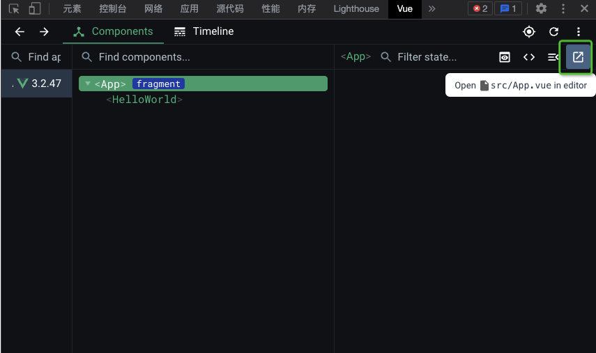
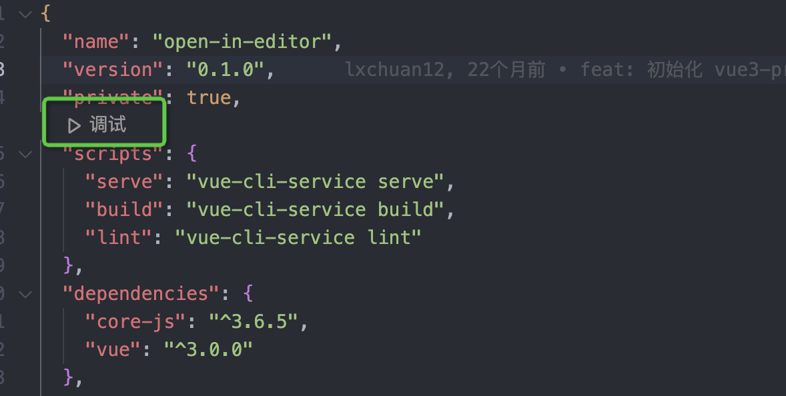
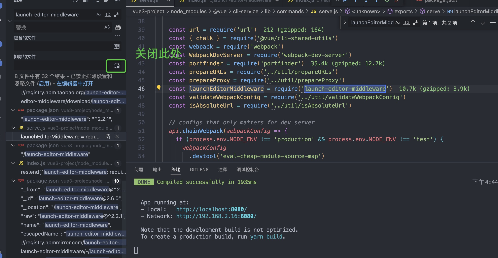

# launch-editor-middleware源码阅读
## 功能
可以在开发环境中点击vue-devtools中的按钮直接用编辑器打开源码文件。<br />
## 环境准备
1. 可以先创建一个vue脚手架项目
2. 找到调试按钮，开启调试



3. 找到launch-editor-middleware所在位置，可以用vscode全局搜索



4. 找到源码位置，进行调试
<a name="st9Rm"></a>
## 原理
<a name="Grmqx"></a>
### 1、注册路由，访问`/__open-in-editor`时，执行中间件。
```javascript
before (app, server) {
  // launch editor support.
  // this works with vue-devtools & @vue/cli-overlay
  app.use('/__open-in-editor', launchEditorMiddleware(() => console.log(
    `To specify an editor, specify the EDITOR env variable or ` +
    `add "editor" field to your Vue project config.\n`
  )))
  // allow other plugins to register middlewares, e.g. PWA
  api.service.devServerConfigFns.forEach(fn => fn(app, server))
  // apply in project middlewares
  projectDevServerOptions.before && projectDevServerOptions.before(app, server)
},
```
<a name="MkdqZ"></a>
### 2、中间件函数代码
```javascript
module.exports = (specifiedEditor, srcRoot, onErrorCallback) => {
  // 如果只传了一个参数，则将specifiedEditor赋值给onErrorCallback，并将specifiedEditor赋为undefined
  if (typeof specifiedEditor === 'function') {
    onErrorCallback = specifiedEditor
    specifiedEditor = undefined
  }
  // 如果只传了两个参数，则将srcRoot赋值给onErrorCallback，并将srcRoot赋为undefined
  if (typeof srcRoot === 'function') {
    onErrorCallback = srcRoot
    srcRoot = undefined
  }

  srcRoot = srcRoot || process.cwd() // 设置根目录

  return function launchEditorMiddleware (req, res, next) {
    const { file } = url.parse(req.url, true).query || {} // 解析文件名
    if (!file) { // 处理文件名不存在的情况
      res.statusCode = 500
      res.end(`launch-editor-middleware: required query param "file" is missing.`)
    } else {
      launch(path.resolve(srcRoot, file), specifiedEditor, onErrorCallback)
      res.end()
    }
  }
}
```
<a name="a2gv6"></a>
### 3、launch函数干了什么
```javascript
function launchEditor (file, specifiedEditor, onErrorCallback) {
  const parsed = parseFile(file) // 解析文件名称，行号和列号
  let { fileName } = parsed
  const { lineNumber, columnNumber } = parsed

  if (!fs.existsSync(fileName)) {
    return
  }

  if (typeof specifiedEditor === 'function') {
    onErrorCallback = specifiedEditor
    specifiedEditor = undefined
  }

  onErrorCallback = wrapErrorCallback(onErrorCallback)
	// 获取编辑器类型
  const [editor, ...args] = guessEditor(specifiedEditor)
  if (!editor) {
    onErrorCallback(fileName, null)
    return
  }
	// ...省略
// 可以理解为单例模式
  if (_childProcess && isTerminalEditor(editor)) {
    _childProcess.kill('SIGKILL')
  }
	// 执行打开文件的命令
  if (process.platform === 'win32') {
    _childProcess = childProcess.spawn(
      'cmd.exe',
      ['/C', editor].concat(args),
      { stdio: 'inherit' }
    )
  } else {
    _childProcess = childProcess.spawn(editor, args, { stdio: 'inherit' })
  }
  // 执行完成后的相应操作
  _childProcess.on('exit', function (errorCode) {
    _childProcess = null

    if (errorCode) {
      onErrorCallback(fileName, '(code ' + errorCode + ')')
    }
  })
  // 执行报错的相应操作
  _childProcess.on('error', function (error) {
    onErrorCallback(fileName, error.message)
  })
}
```

1. **解析文件信息，包括名称、行列号，判断文件是否存在**
2. **获取当前编辑器，并返回对应的信息**
3. **利用child_process模块执行打开文件命令（省略兼容操作）**
<a name="qhdiQ"></a>
#### wrapErrorCallback函数
传入一个回调函数，并返回一个带有默认打印信息的函数。
```javascript
function wrapErrorCallback (cb) {
  return (fileName, errorMessage) => {
    console.log()
    console.log(
      colors.red('Could not open ' + path.basename(fileName) + ' in the editor.')
    )
    if (errorMessage) {
      if (errorMessage[errorMessage.length - 1] !== '.') {
        errorMessage += '.'
      }
      console.log(
        colors.red('The editor process exited with an error: ' + errorMessage)
      )
    }
    console.log()
    if (cb) cb(fileName, errorMessage)
  }
}
```
<a name="Jforx"></a>
## 总结

1. 大致原理可以理解为：

1.1 首先注册一个后端路由，当在vue-devtools中点击查看文件时，会拿着文件路径去请求此路由。<br />1.2 此路由被请求到时，会解析路径，如果file参数没有传的话，直接返回500错误。<br />1.3 之后就是解析文件信息，包括名称、行列号,获取当前编辑器,并利用child_process模块执行相应的命令。
<a name="hk4oF"></a>
## 参考
[源码地址](https://github.com/yyx990803/launch-editor)