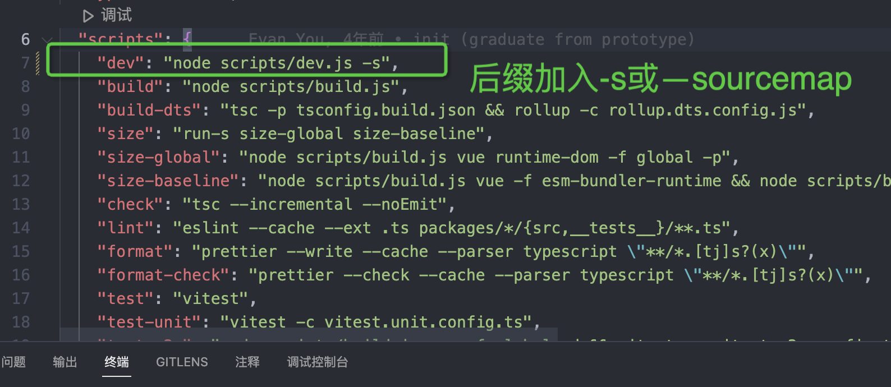

# vue3源码之工具函数
## 1. 调试准备
1. 首先下载源码`git clone git@github.com:vuejs/core.git`
2. 安装依赖 pnpm i（node v16.15.0）
3. 开启`soucemap`



4. 使用命令`pnpm run dev`进行打包操作
5. 自己创建一个html文件，并引入`packages/vue/dist/vue.global.js`文件。
6. 自己使用`live server`插件运行html。
<a name="jpALT"></a>
## 2. 工具函数
<a name="gMiK0"></a>
### 2.1 EMPTY_OBJ
```javascript
export const EMPTY_OBJ: { readonly [key: string]: any } = __DEV__
  ? Object.freeze({})
  : {}
```
理解：冻结对象，使其无法拓展（仅dev环境生效），属于浅冻结。
<a name="enfv5"></a>
### 2.2 EMPTY_ARR
```javascript
export const EMPTY_ARR = __DEV__ ? Object.freeze([]) : []
```
理理解：冻结数组，使其无法拓展（仅dev环境生效）。
<a name="w27Pi"></a>
### 2.3 NOOP
```javascript
export const NOOP = () => {}
```
理解：一个空的箭头函数
<a name="O9kE6"></a>
### 2.4 NO
```javascript
export const NO = () => false
```
理解：一个函数返回false
<a name="P38vY"></a>
### 2.5 isOn
```javascript
const onRE = /^on[^a-z]/
export const isOn = (key: string) => onRE.test(key)
```
理解：判断key是否以on开头
<a name="WeJxW"></a>
### 2.6 isModelListener
```javascript
export const isModelListener = (key: string) => key.startsWith('onUpdate:')
```
理解：判断key是否以`onUpdate`:开头<br />拓展：<br />`String.prototype.startsWith`

- 用法：`str.startsWith(searchString[, position])`
- searchString：要搜索的子串
- position: 在 str 中搜索 searchString 的开始位置，默认值为 0。

<a name="pHs9f"></a>
### 2.7 extend
```javascript
export const extend = Object.assign
```
拓展：<br />`Object.assign`可以当做浅拷贝的一种

- 用法：`Object.assign(target, ...sources)`
- target：目标对象，接收源对象属性的对象，也是修改后的返回值。
- sources：源对象，包含将被合并的属性。
- 返回值：target
<a name="e9SpW"></a>
### 2.8 remove
```javascript
export const remove = <T>(arr: T[], el: T) => {
  const i = arr.indexOf(el)
  if (i > -1) {
    arr.splice(i, 1)
  }
}
```
理解：传入一个数组和目标元素，如果找到目标元素，则删除；
<a name="nGvh9"></a>
### 2.9 hasOwn
```javascript
const hasOwnProperty = Object.prototype.hasOwnProperty
export const hasOwn = (
  val: object,
  key: string | symbol
): key is keyof typeof val => hasOwnProperty.call(val, key)
```
理解：传入一个对象和key，判断这个对象自身是否有key这个属性。<br />拓展：<br />`Object.prototype.hasOwnProperty`

- 用法：`obj.hasOwnProperty(prop)`
- prop：要检测的key
- 返回值：一个布尔值
<a name="T0DN8"></a>
### 2.10 isArray
```javascript
export const isArray = Array.isArray
```
拓展：<br />`Array.isArray`

- 用法：`Array.isArray(value)`
- value：需要检测的值。
- 返回值：一个布尔值
- 简单实现-`const isArray = (arr) => Object.prototype.toString.call(arr) === '[object Array]'`
<a name="DAAia"></a>
### 2.11 isMap
```javascript
export const isMap = (val: unknown): val is Map<any, any> =>
  toTypeString(val) === '[object Map]'
```
理解：在 JavaScript 中，所有对象都有一个内部属性 [[Class]]，用于指示该对象的类型。可以使用 Object.prototype.toString() 方法获取一个对象的 [[Class]] 值。所以用此方法来进行判断。
<a name="PVXPL"></a>
### 2.12 isSet
```javascript
export const isSet = (val: unknown): val is Set<any> =>
  toTypeString(val) === '[object Set]'
```
<a name="Lfmwl"></a>
### 2.13 isDate
```javascript
export const isDate = (val: unknown): val is Date =>
  toTypeString(val) === '[object Date]'
```
<a name="OZnpR"></a>
### 2.14 isRegExp
```javascript
export const isRegExp = (val: unknown): val is RegExp =>
  toTypeString(val) === '[object RegExp]'
```
<a name="UAOV3"></a>
### 2.15 isFunction
```javascript
export const isFunction = (val: unknown): val is Function =>
  typeof val === 'function'
```
<a name="PndON"></a>
### 2.16 isString
```javascript
export const isString = (val: unknown): val is string => typeof val === 'string'
```
<a name="Sm6B4"></a>
### 2.17 isSymbol
```javascript
export const isSymbol = (val: unknown): val is symbol => typeof val === 'symbol'
```
<a name="XaB3y"></a>
### 2.18 isObject
```javascript
export const isObject = (val: unknown): val is Record<any, any> =>
  val !== null && typeof val === 'object'
```
理解：由于typeof null也是object，所以里面需要加入一个条件，val !== null。
<a name="uTzDz"></a>
### 2.19 isPromise
```javascript
export const isPromise = <T = any>(val: unknown): val is Promise<T> => {
  return isObject(val) && isFunction(val.then) && isFunction(val.catch)
}
```
理解：Promise属于一个鸭子模型，所以只要是个对象，并且then和catch方法是个函数，则此对象为Promise对象。
<a name="UmHBN"></a>
### 2.20 toTypeString
```javascript
export const objectToString = Object.prototype.toString
export const toTypeString = (value: unknown): string =>
  objectToString.call(value)
```
理解：获取对象的`[[Class]]`属性，例如`[object Number]`
<a name="Z3nm6"></a>
### 2.21 toRawType
```javascript
export const toRawType = (value: unknown): string => {
  // extract "RawType" from strings like "[object RawType]"
  return toTypeString(value).slice(8, -1)
}
```
理解：获取原始类型，返回例如`Object`、`Number`...
<a name="c9J8L"></a>
### 2.22 isPlainObject
```javascript
export const isPlainObject = (val: unknown): val is object =>
  toTypeString(val) === '[object Object]'
```
理解：判断一个对象是否为原始对象，例如数组不是原始对象。
<a name="sYLAN"></a>
### 2.23 isIntegerKey
```typescript
export const isIntegerKey = (key: unknown) =>
  isString(key) &&
  key !== 'NaN' &&
  key[0] !== '-' &&
  '' + parseInt(key, 10) === key
```
理解：用于判断一个键是否为整数类型的键
<a name="KRzcl"></a>
### 2.24 isReservedProp
```javascript
export const isReservedProp = /*#__PURE__*/ makeMap(
  // the leading comma is intentional so empty string "" is also included
  ',key,ref,ref_for,ref_key,' +
    'onVnodeBeforeMount,onVnodeMounted,' +
    'onVnodeBeforeUpdate,onVnodeUpdated,' +
    'onVnodeBeforeUnmount,onVnodeUnmounted'
)
export function makeMap(
  str: string,
  expectsLowerCase?: boolean
): (key: string) => boolean {
  const map: Record<string, boolean> = Object.create(null)
  const list: Array<string> = str.split(',')
  for (let i = 0; i < list.length; i++) {
    map[list[i]] = true
  }
  return expectsLowerCase ? val => !!map[val.toLowerCase()] : val => !!map[val]
}
```
理解：<br />`makeMap`

- 参数：str-需要转换成对象形式的字符串，expectsLowerCase-返回函数是否都以小写来判断。
- 返回值：一个函数，可以用来判断传入的key是否在map对象内；

`isReservedProp`：用来判断传入参数是否为Vue3的保留属性。
<a name="QBpZ1"></a>
### 2.25 isBuiltInDirective
```typescript
export const isBuiltInDirective = /*#__PURE__*/ makeMap(
  'bind,cloak,else-if,else,for,html,if,model,on,once,pre,show,slot,text,memo'
)
```
理解：用来判断传入参数是否为Vue3保留指令。
<a name="djOZA"></a>
### 2.26 cacheStringFunction
```typescript
const cacheStringFunction = <T extends (str: string) => string>(fn: T): T => {
  const cache: Record<string, string> = Object.create(null)
  return ((str: string) => {
    const hit = cache[str]
    return hit || (cache[str] = fn(str))
  }) as T
}
```
理解：此函数接受一个函数fn，内部创建一个cache变量，返回一个函数，此函数为需传入一个字符串，当cache已经存在fn处理过的值，则返回，否则挂载到cache下，以字符串为key，fn(key)为结果。从ts来看，fn需要也返回一个string类型。
<a name="MbJm7"></a>
### 2.27 camelize
```typescript
const camelizeRE = /-(\w)/g
/**
 * @private
 */
export const camelize = cacheStringFunction((str: string): string => {
  return str.replace(camelizeRE, (_, c) => (c ? c.toUpperCase() : ''))
})
```
理解：用于将字符串中的短横线命名法（kebab-case）转换为驼峰命名法（camelCase）。例如，将字符串 "background-color" 转换为 "backgroundColor"。
<a name="vLp7r"></a>
### 2.28 hyphenate
```typescript
const hyphenateRE = /\B([A-Z])/g
/**
 * @private
 */
export const hyphenate = cacheStringFunction((str: string) =>
  str.replace(hyphenateRE, '-$1').toLowerCase()
)
```
理解：和上面那个方法相反，例如，将字符串 "backgroundColor" 转换为 "background-color"。<br />拓展：\B在正则当中的意思是非单词边界。例如“BackgroundColor”会被转换成“Background-color”
<a name="cfykm"></a>
### 2.29 capitalize
```typescript
export const capitalize = cacheStringFunction(
  (str: string) => str.charAt(0).toUpperCase() + str.slice(1)
)
```
理解：将首字母大写，并将结果存储起来。
<a name="DUWxi"></a>
### 2.30 toHandlerKey
```typescript
export const toHandlerKey = cacheStringFunction((str: string) =>
  str ? `on${capitalize(str)}` : ``
)
```
理解：给str拼接上on，并将拼接好的字符串存储起来。
<a name="uZB4F"></a>
### 2.31 hasChanged
```typescript
export const hasChanged = (value: any, oldValue: any): boolean =>
  !Object.is(value, oldValue)
```
理解：判断两个值是否为同一个<br />拓展：<br />`Object.is`<br />Object.is() 方法判断两个值是否为同一个值，如果满足以下任意条件则两个值相等：

- 都是 [undefined](https://developer.mozilla.org/zh-CN/docs/Web/JavaScript/Reference/Global_Objects/undefined)
- 都是 [null](https://developer.mozilla.org/zh-CN/docs/Web/JavaScript/Reference/Operators/null)
- 都是 true 或都是 false
- 都是相同长度、相同字符、按相同顺序排列的字符串
- 都是相同对象（意味着都是同一个对象的值引用）
- 都是数字且
   - 都是 +0
   - 都是 -0
   - 都是 [NaN](https://developer.mozilla.org/zh-CN/docs/Web/JavaScript/Reference/Global_Objects/NaN)
   - 都是同一个值，非零且都不是 [NaN](https://developer.mozilla.org/zh-CN/docs/Web/JavaScript/Reference/Global_Objects/NaN)
<a name="P5Nys"></a>
### 2.32 invokeArrayFns
```typescript
export const invokeArrayFns = (fns: Function[], arg?: any) => {
  for (let i = 0; i < fns.length; i++) {
    fns[i](arg)
  }
}
```
理解：传入一个函数列表以及参数，for循环执行。
<a name="LkH20"></a>
### 2.33 def
```typescript
export const def = (obj: object, key: string | symbol, value: any) => {
  Object.defineProperty(obj, key, {
    configurable: true,
    enumerable: false,
    value
  })
}
```
理解：定义一个值，不可枚举和修改value值。
<a name="eXsY2"></a>
### 2.34 looseToNumber
```typescript
export const looseToNumber = (val: any): any => {
  const n = parseFloat(val)
  return isNaN(n) ? val : n
}
```
理解：传入一个值，如果被parseFloat转换后为NaN，则返回自身，否则返回转换后的数字。
<a name="sK9dW"></a>
### 2.35 toNumber
```typescript
export const toNumber = (val: any): any => {
  const n = isString(val) ? Number(val) : NaN
  return isNaN(n) ? val : n
}
```
理解：传入一个值，如果为字符串，则尝试转换成数字，如果不是数字返回自身，否则返回数字。
<a name="xYrd9"></a>
### 2.36 getGlobalThis
```typescript
let _globalThis: any
export const getGlobalThis = (): any => {
  return (
    _globalThis ||
    (_globalThis =
      typeof globalThis !== 'undefined'
        ? globalThis
        : typeof self !== 'undefined'
        ? self
        : typeof window !== 'undefined'
        ? window
        : typeof global !== 'undefined'
        ? global
        : {})
  )
}
```
理解：执行函数，获取全局上下文，_globalThis会被缓存。
<a name="KbWvZ"></a>
### 2.37 genPropsAccessExp
```typescript
const identRE = /^[_$a-zA-Z\xA0-\uFFFF][_$a-zA-Z0-9\xA0-\uFFFF]*$/


export function genPropsAccessExp(name: string) {
  return identRE.test(name)
    ? `__props.${name}`
    : `__props[${JSON.stringify(name)}]`
}
```
理解：首先使用正则表达式判断name是否符合javascript中标识符的规范，否则的话用`.`来访问，否则，将使用`[]`来访问。