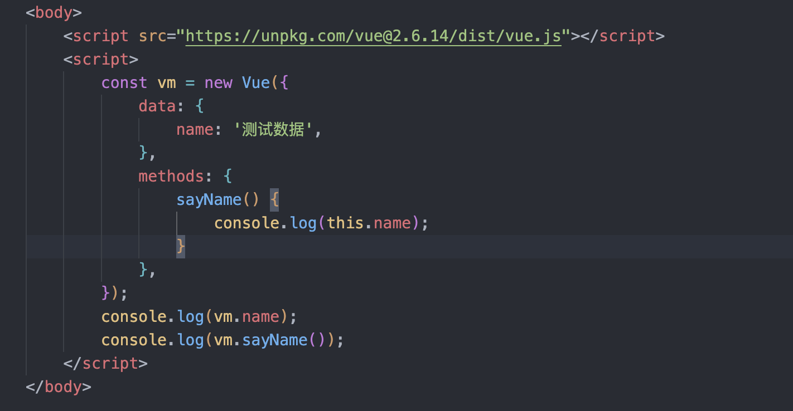
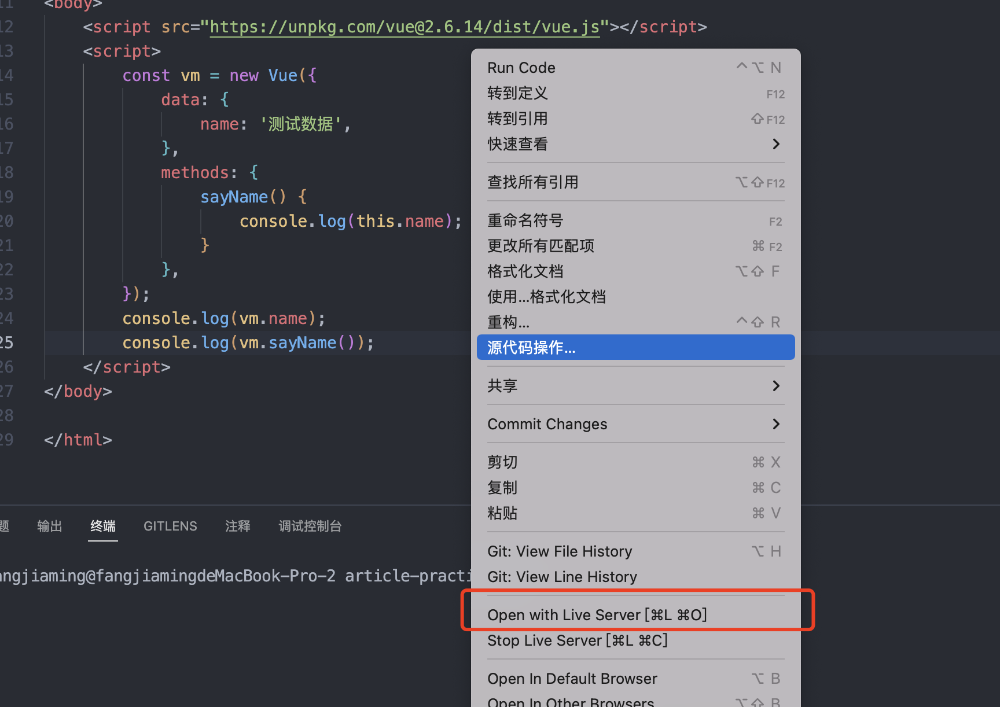
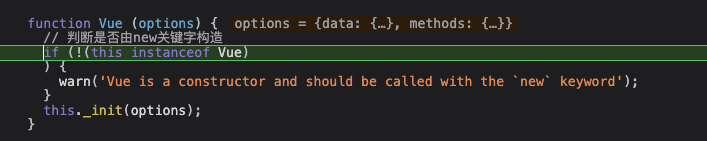
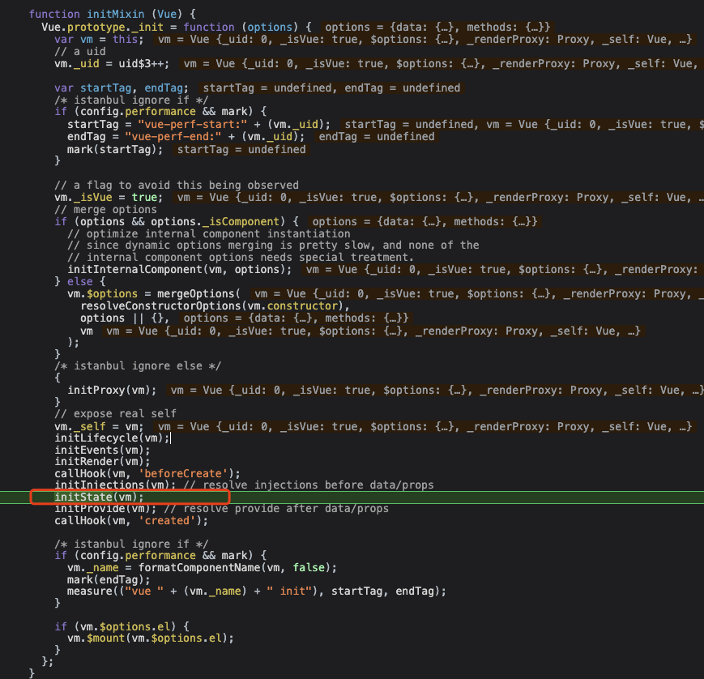

# vue2中this如何能够直接拿到data和methods?
## 调试准备
1. 首先建一个html文件，引入Vue，并实例一个Vue实例。



2. 使用插件启动项目



3. 在`new Vue`之前可以打上`debugger`，之后打开浏览器可进行调试。
##  调试
<a name="vLXww"></a>
### vue构造函数
<a name="ebg3Z"></a>
#### 1. Vue实例阶段
<br />判断是否由new关键字执行，然后执行_init方法
<a name="wxSXE"></a>
#### 2. _init方法
<br />_init方法指向initMixin方法，这个方法做了很多事情，之后我们再看其他的一些方法，这次我们先来看initState这个方法。
<a name="TlQl9"></a>
#### 3. initState方法
```typescript
function initState (vm) {
  vm._watchers = [];
  var opts = vm.$options;
  if (opts.props) { initProps(vm, opts.props); }
  if (opts.methods) { initMethods(vm, opts.methods); }
  if (opts.data) {
    initData(vm);
  } else {
    observe(vm._data = {}, true /* asRootData */);
  }
  if (opts.computed) { initComputed(vm, opts.computed); }
  if (opts.watch && opts.watch !== nativeWatch) {
    initWatch(vm, opts.watch);
  }
}
```
这个方法处理数据顺序：`props`->`methods`->`data`->`computed`->`watch`，这次我们先来看initMethods方法。
<a name="GLThe"></a>
#### 4. initMethods方法
```typescript
function initMethods (vm, methods) {
      // 获取props对象
      var props = vm.$options.props;
      // 遍历methods对象
      for (var key in methods) {
        {
          // 如果传入的method不是一个函数，则进行警告
          if (typeof methods[key] !== 'function') {
            warn(
              "Method \"" + key + "\" has type \"" + (typeof methods[key]) + "\" in the component definition. " +
              "Did you reference the function correctly?",
              vm
            );
          }
          // 如果props存在，且props对象已经存在这个key名了，则进行警告
          if (props && hasOwn(props, key)) {
            warn(
              ("Method \"" + key + "\" has already been defined as a prop."),
              vm
            );
          }
          // 如果key是Vue的保留属性也进行警告
          if ((key in vm) && isReserved(key)) {
            warn(
              "Method \"" + key + "\" conflicts with an existing Vue instance method. " +
              "Avoid defining component methods that start with _ or $."
            );
          }
        }
        // 将method直接挂在vm下，如果不是函数，则返回一个空函数，否则将会把method的this绑定到vm上。
        vm[key] = typeof methods[key] !== 'function' ? noop : bind(methods[key], vm);
      }
    }
```
从上面的代码来看，`methods`和`props`如果有相同的`key`，`method`将会覆盖`prop`。<br />所以从上面的代码来看，能直接访问到`this.[method]`的原理就是`Vue`直接将`methods`挂到了`vm实例`下。
<a name="DwrgB"></a>
#### 5. initData方法
initData做了这些事
```typescript
1. 先获取data，如果data为函数，则执行函数，然后将_data挂到了vm下
2. 接下来判断data是否为原始对象
3. 获取props、methods，遍历data对象，如果已经存在data中的key，则进行警告
4. 如果key不是保留字段，则进行代理操作，执行proxy函数
5. 最后将执行observer函数，来观测data对象（数据响应式重点）
```
```typescript
function initData (vm) {
      var data = vm.$options.data;
      data = vm._data = typeof data === 'function'
        ? getData(data, vm)
        : data || {};
      if (!isPlainObject(data)) {
        data = {};
        warn(
          'data functions should return an object:\n' +
          'https://vuejs.org/v2/guide/components.html#data-Must-Be-a-Function',
          vm
        );
      }
      // proxy data on instance
      var keys = Object.keys(data);
      var props = vm.$options.props;
      var methods = vm.$options.methods;
      var i = keys.length;
      while (i--) {
        var key = keys[i];
        {
          if (methods && hasOwn(methods, key)) {
            warn(
              ("Method \"" + key + "\" has already been defined as a data property."),
              vm
            );
          }
        }
        if (props && hasOwn(props, key)) {
          warn(
            "The data property \"" + key + "\" is already declared as a prop. " +
            "Use prop default value instead.",
            vm
          );
        } else if (!isReserved(key)) {
          proxy(vm, "_data", key);
        }
      }
      // observe data
      observe(data, true /* asRootData */);
    }
```
<a name="TUG7E"></a>
#### 6. proxy函数
```typescript
var sharedPropertyDefinition = {
  enumerable: true,
  configurable: true,
  get: noop,
  set: noop
};
function proxy (target, sourceKey, key) {
  sharedPropertyDefinition.get = function proxyGetter () {
    return this[sourceKey][key]
  };
  sharedPropertyDefinition.set = function proxySetter (val) {
    this[sourceKey][key] = val;
  };
  Object.defineProperty(target, key, sharedPropertyDefinition);
}
```
从此方法来看，使用了`Object.defineProperty`方法，利用`descriptor`中的`set`、`get`方法，来进行代理。<br />我们来看下`Object.defineProperty`的用法。
```typescript
Object.defineProperty(obj, prop, descriptor)
```

- obj 表示需要定义属性的对象；
- prop 表示需要定义的属性名；
- descriptor 是一个 JavaScript 对象，用于描述属性的特性，包括 value、writable、enumerable、configurable、get 和 set 等。

JS中数据分为数据描述符（`enumerable`，`configurable`，`value`，`writable`），存取描述符（`enumerable`，`configurable`，`set()`，`get()`）。
<a name="qIBkD"></a>
#### 7. 简单实现
```typescript
function Vue(options) {
    let vm = this;
    vm.$options = options;
    initState(vm)
}
function initState(vm) {
    let opts = vm.$options;
    if (opts.methods) {
        initMethods(vm, opts.methods);
    }
    if(opts.data) {
        initData(vm, opts.data)
    }
}
function initMethods(vm, methods) {
    for (let i in methods) {
        vm[i] = methods[i].bind(vm);
    }
}
function initData(vm, data) {
    vm._data = data = typeof data === 'function' ? data.call(vm, vm) : data;
    let keys = Object.keys(data);
    let len = keys.length;
    while(len--) {
        proxy(vm, "_data", keys[len])
    }
}
function noop() {}
var sharedPropertyDefinition = {
    enumerable: true,
    configurable: true,
    get: noop,
    set: noop
};
function proxy(vm, sourceKey, key) {
    sharedPropertyDefinition.get = function() {
        return vm[sourceKey][key];
    }
    sharedPropertyDefinition.set = function(val) {
        vm[sourceKey][key] = val;
    }
    Object.defineProperty(vm, key, sharedPropertyDefinition)
}
let aa = new Vue({
    data() {
        return {
            name: "123"
        }
    },
    methods: {
        sayName() {

        }
    }
})
```
<a name="BWGIB"></a>
#### 8. 总结
vue是将`methods`里面的方法直接定义到`vm`实例上，并且函数直接`bind`到`vm`上，而`data`里面的属性则不同，`data`是通过`Object.defindProperty`这个方法代理到_data对象里面，所以访问`this.name`，会指向`this._data.name`