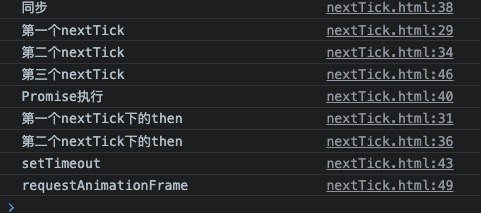

# nextTick 简单实现

## 实现
```javascript
let fn = []; // 定义存储函数的数组
let isPending = false; // 标识nextTick是否在任务队列中
let res = null; // 存储Promise对象
let nextTick = function(callback) {
    fn.push(callback);
    if(isPending) {
        return res;
    }
    isPending = true;
    res = Promise.resolve().then(() => {
        while(fn.length) {
            fn.shift()();
        }
        res = null;
    });
    return res;
}
```
## 测试代码
```javascript
nextTick(() => {
    console.log(123);
}).then(() => {
    console.log("下一个pro111");
})
nextTick(() => {
    console.log(111);
}).then(() => {
    console.log("下一个pro");
})
console.log(456);
Promise.resolve().then(() => {
    console.log("哈哈哈哈");
})
setTimeout(() => {
    console.log("settime");
})
nextTick(() => {
    console.log(222);
})
requestAnimationFrame(() => {
    console.log('requestAnimationFrame');
})
```
## 结果

