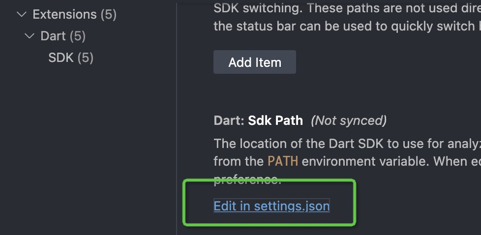
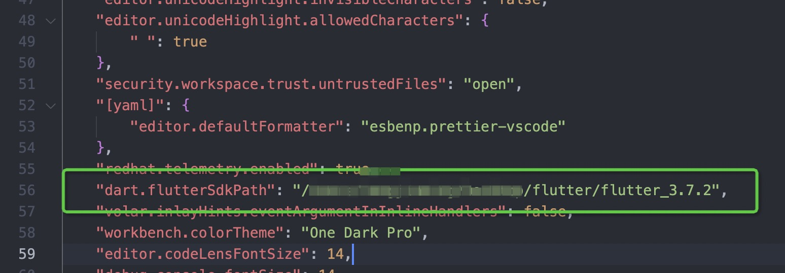

# 小提示
## vscode中output栏和终端栏用的Dart版本不一致问题
### 原因
如果在 VSCode 的 Output 窗口中看到的 Dart 版本与终端中的版本不同，可能是因为 VSCode 使用的是自己的 Dart SDK 路径而不是您在终端中使用的路径。这通常是因为您在 VSCode 中使用的 Dart 插件配置了自己的 SDK 路径。
### 解决办法
1. 在 VSCode 中打开设置（Code -> Preferences -> Settings）并搜索 “Dart: Sdk Path” 配置项，检查其值是否与您在终端中使用的路径相同。

2. 修改为自己的路径

