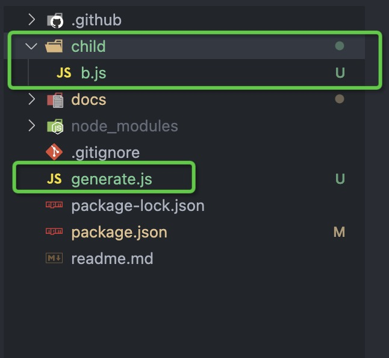

# node小技巧
## 获取当前执行文件绝对路径方法

### type为commonjs
```javascript
// generate.js
require("./child/b.js")
console.log(`文件夹路径：${__dirname}`);
console.log(`文件路径：${__filename}`);
// b.js
console.log(`子模块文件夹路径：${__dirname}`);
console.log(`子模块文件路径：${__filename}`);
```
```
// 结果
子模块文件夹路径：/Users/fangjiaming/Desktop/lruri/child
子模块文件路径：/Users/fangjiaming/Desktop/lruri/child/b.js
文件夹路径：/Users/fangjiaming/Desktop/lruri
文件路径：/Users/fangjiaming/Desktop/lruri/generate.js
```
### type为module
```javascript
// generate.js
import path from "path"
import "./child/b.js"
const modulePath = new URL(import.meta.url).pathname;
const moduleDir = path.dirname(modulePath);
console.log(`文件夹路径：${moduleDir}`);
console.log(`文件路径：${modulePath}`);
// b.js
import path from "path"
const modulePath = new URL(import.meta.url).pathname;
const moduleDir = path.dirname(modulePath);
console.log(`子模块文件夹路径：${moduleDir}`);
console.log(`子模块文件路径${modulePath}`);
```
```
// 结果
子模块文件夹路径：/Users/fangjiaming/Desktop/lruri/child
子模块文件路径/Users/fangjiaming/Desktop/lruri/child/b.js
文件夹路径：/Users/fangjiaming/Desktop/lruri
文件路径：/Users/fangjiaming/Desktop/lruri/generate.js
```
### 额外知识
* `import.meta.url`是 JavaScript 中一个元数据(meta-data)属性，它返回当前模块文件的 URL 地址。
* `__dirname` 获取模块所属目录的绝对路径
* `__filename` 获取当前模块的文件路径

## 参考
[import.meta文档](https://developer.mozilla.org/zh-CN/docs/Web/JavaScript/Reference/Operators/import.meta)  
[node.js下module对象文档](https://nodejs.org/dist/latest-v18.x/docs/api/modules.html#__filename)